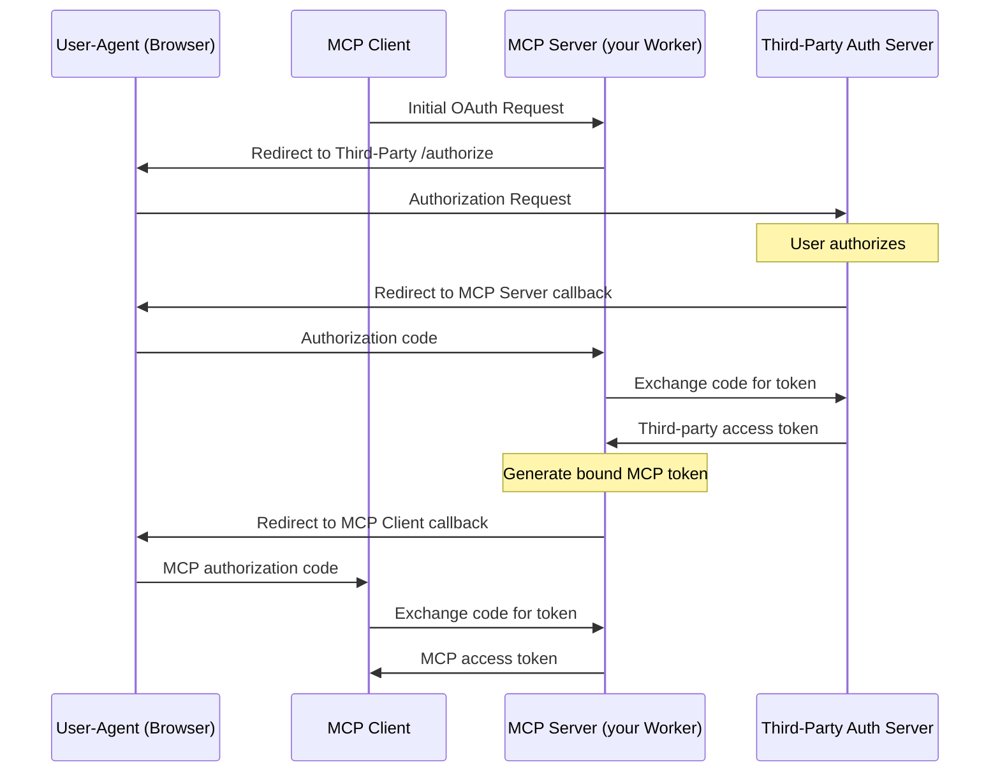

---
title: Agents · Cloudflare Agents docs
description: The Agents SDK enables you to build and deploy AI-powered agents
  that can autonomously perform tasks, communicate with clients in real time,
  call AI models, persist state, schedule tasks, run asynchronous workflows,
  browse the web, query data from your database, support human-in-the-loop
  interactions, and a lot more.
lastUpdated: 2025-03-18T12:13:40.000Z
chatbotDeprioritize: false
source_url:
  html: https://developers.cloudflare.com/agents/
  md: https://developers.cloudflare.com/agents/index.md
---

The Agents SDK enables you to build and deploy AI-powered agents that can autonomously perform tasks, communicate with clients in real time, call AI models, persist state, schedule tasks, run asynchronous workflows, browse the web, query data from your database, support human-in-the-loop interactions, and [a lot more](https://developers.cloudflare.com/agents/api-reference/).

### Ship your first Agent

To use the Agent starter template and create your first Agent with the Agents SDK:

```sh
# install it
npm create cloudflare@latest agents-starter -- --template=cloudflare/agents-starter
# and deploy it
npx wrangler@latest deploy
```

Head to the guide on [building a chat agent](https://developers.cloudflare.com/agents/getting-started/build-a-chat-agent) to learn how the starter project is built and how to use it as a foundation for your own agents.

If you're already building on [Workers](https://developers.cloudflare.com/workers/), you can install the `agents` package directly into an existing project:

```sh
npm i agents
```

And then define your first Agent by creating a class that extends the `Agent` class:

* JavaScript

  ```js
  import { Agent, AgentNamespace } from "agents";


  export class MyAgent extends Agent {
    // Define methods on the Agent:
    // https://developers.cloudflare.com/agents/api-reference/agents-api/
    //
    // Every Agent has built in state via this.setState and this.sql
    // Built-in scheduling via this.schedule
    // Agents support WebSockets, HTTP requests, state synchronization and
    // can run for seconds, minutes or hours: as long as the tasks need.
  }
  ```

* TypeScript

  ```ts
  import { Agent, AgentNamespace } from 'agents';


  export class MyAgent extends Agent {
    // Define methods on the Agent:
    // https://developers.cloudflare.com/agents/api-reference/agents-api/
    //
    // Every Agent has built in state via this.setState and this.sql
    // Built-in scheduling via this.schedule
    // Agents support WebSockets, HTTP requests, state synchronization and
    // can run for seconds, minutes or hours: as long as the tasks need.
  }
  ```

Dive into the [Agent SDK reference](https://developers.cloudflare.com/agents/api-reference/agents-api/) to learn more about how to use the Agents SDK package and defining an `Agent`.

### Why build agents on Cloudflare?

We built the Agents SDK with a few things in mind:

* **Batteries (state) included**: Agents come with [built-in state management](https://developers.cloudflare.com/agents/api-reference/store-and-sync-state/), with the ability to automatically sync state between an Agent and clients, trigger events on state changes, and read+write to each Agent's SQL database.
* **Communicative**: You can connect to an Agent via [WebSockets](https://developers.cloudflare.com/agents/api-reference/websockets/) and stream updates back to client in real-time. Handle a long-running response from a reasoning model, the results of an [asynchronous workflow](https://developers.cloudflare.com/agents/api-reference/run-workflows/), or build a chat app that builds on the `useAgent` hook included in the Agents SDK.
* **Extensible**: Agents are code. Use the [AI models](https://developers.cloudflare.com/agents/api-reference/using-ai-models/) you want, bring-your-own headless browser service, pull data from your database hosted in another cloud, add your own methods to your Agent and call them.

Agents built with Agents SDK can be deployed directly to Cloudflare and run on top of [Durable Objects](https://developers.cloudflare.com/durable-objects/) — which you can think of as stateful micro-servers that can scale to tens of millions — and are able to run wherever they need to. Run your Agents close to a user for low-latency interactivity, close to your data for throughput, and/or anywhere in between.

***

### Build on the Cloudflare Platform

**[Workers](https://developers.cloudflare.com/workers/)**

Build serverless applications and deploy instantly across the globe for exceptional performance, reliability, and scale.

**[AI Gateway](https://developers.cloudflare.com/ai-gateway/)**

Observe and control your AI applications with caching, rate limiting, request retries, model fallback, and more.

**[Vectorize](https://developers.cloudflare.com/vectorize/)**

Build full-stack AI applications with Vectorize, Cloudflare’s vector database. Adding Vectorize enables you to perform tasks such as semantic search, recommendations, anomaly detection or can be used to provide context and memory to an LLM.

**[Workers AI](https://developers.cloudflare.com/workers-ai/)**

Run machine learning models, powered by serverless GPUs, on Cloudflare's global network.

**[Workflows](https://developers.cloudflare.com/workflows/)**

Build stateful agents that guarantee executions, including automatic retries, persistent state that runs for minutes, hours, days, or weeks.


---
title: 404 - Page Not Found · Cloudflare Agents docs
chatbotDeprioritize: false
source_url:
  html: https://developers.cloudflare.com/agents/404/
  md: https://developers.cloudflare.com/agents/404/index.md
---

# 404

Check the URL, try using our [search](https://developers.cloudflare.com/search/) or try our LLM-friendly [llms.txt directory](https://developers.cloudflare.com/llms.txt).


---
title: API Reference · Cloudflare Agents docs
description: "Learn more about what Agents can do, the Agent class, and the APIs
  that Agents expose:"
lastUpdated: 2025-03-18T12:13:40.000Z
chatbotDeprioritize: false
source_url:
  html: https://developers.cloudflare.com/agents/api-reference/
  md: https://developers.cloudflare.com/agents/api-reference/index.md
---

Learn more about what Agents can do, the `Agent` class, and the APIs that Agents expose:

* [Agents API](https://developers.cloudflare.com/agents/api-reference/agents-api/)
* [Calling Agents](https://developers.cloudflare.com/agents/api-reference/calling-agents/)
* [Using AI Models](https://developers.cloudflare.com/agents/api-reference/using-ai-models/)
* [Schedule tasks](https://developers.cloudflare.com/agents/api-reference/schedule-tasks/)
* [Run Workflows](https://developers.cloudflare.com/agents/api-reference/run-workflows/)
* [Store and sync state](https://developers.cloudflare.com/agents/api-reference/store-and-sync-state/)
* [Browse the web](https://developers.cloudflare.com/agents/api-reference/browse-the-web/)
* [HTTP and Server-Sent Events](https://developers.cloudflare.com/agents/api-reference/http-sse/)
* [Retrieval Augmented Generation](https://developers.cloudflare.com/agents/api-reference/rag/)
* [Using WebSockets](https://developers.cloudflare.com/agents/api-reference/websockets/)
* [Configuration](https://developers.cloudflare.com/agents/api-reference/configuration/)


---
title: Concepts · Cloudflare Agents docs
lastUpdated: 2025-02-25T13:55:21.000Z
chatbotDeprioritize: true
source_url:
  html: https://developers.cloudflare.com/agents/concepts/
  md: https://developers.cloudflare.com/agents/concepts/index.md
---

* [Agents](https://developers.cloudflare.com/agents/concepts/what-are-agents/)
* [Workflows](https://developers.cloudflare.com/agents/concepts/workflows/)
* [Tools](https://developers.cloudflare.com/agents/concepts/tools/)
* [Human in the Loop](https://developers.cloudflare.com/agents/concepts/human-in-the-loop/)
* [Calling LLMs](https://developers.cloudflare.com/agents/concepts/calling-llms/)


---
title: Getting started · Cloudflare Agents docs
lastUpdated: 2025-02-25T13:55:21.000Z
chatbotDeprioritize: true
source_url:
  html: https://developers.cloudflare.com/agents/getting-started/
  md: https://developers.cloudflare.com/agents/getting-started/index.md
---

* [Build a Chat Agent](https://github.com/cloudflare/agents-starter)
* [Testing your Agents](https://developers.cloudflare.com/agents/getting-started/testing-your-agent/)
* [Prompt an AI model](https://developers.cloudflare.com/workers/get-started/prompting/)


---
title: Guides · Cloudflare Agents docs
lastUpdated: 2025-02-25T13:55:21.000Z
chatbotDeprioritize: true
source_url:
  html: https://developers.cloudflare.com/agents/guides/
  md: https://developers.cloudflare.com/agents/guides/index.md
---

* [Build a Human-in-the-loop Agent](https://github.com/cloudflare/agents/tree/main/guides/human-in-the-loop)
* [Implement Effective Agent Patterns](https://github.com/cloudflare/agents/tree/main/guides/anthropic-patterns)
* [Build a Remote MCP server](https://developers.cloudflare.com/agents/guides/remote-mcp-server/)
* [Test a Remote MCP Server](https://developers.cloudflare.com/agents/guides/test-remote-mcp-server/)
* [Build a Remote MCP Client](https://github.com/cloudflare/ai/tree/main/demos/mcp-client)


---
title: Model Context Protocol (MCP) · Cloudflare Agents docs
description: You can build and deploy Model Context Protocol (MCP) servers on Cloudflare.
lastUpdated: 2025-05-01T13:39:24.000Z
chatbotDeprioritize: false
source_url:
  html: https://developers.cloudflare.com/agents/model-context-protocol/
  md: https://developers.cloudflare.com/agents/model-context-protocol/index.md
---

You can build and deploy [Model Context Protocol (MCP)](https://modelcontextprotocol.io/) servers on Cloudflare.

## What is the Model Context Protocol (MCP)?

[Model Context Protocol (MCP)](https://modelcontextprotocol.io) is an open standard that connects AI systems with external applications. Think of MCP like a USB-C port for AI applications. Just as USB-C provides a standardized way to connect your devices to various accessories, MCP provides a standardized way to connect AI agents to different services.

### MCP Terminology

* **MCP Hosts**: AI assistants (like [Claude](http://claude.ai) or [Cursor](http://cursor.com)), AI agents, or applications that need to access external capabilities.
* **MCP Clients**: Clients embedded within the MCP hosts that connect to MCP servers and invoke tools. Each MCP client instance has a single connection to an MCP server.
* **MCP Servers**: Applications that expose [tools](https://developers.cloudflare.com/agents/model-context-protocol/tools/), [prompts](https://modelcontextprotocol.io/docs/concepts/prompts), and [resources](https://modelcontextprotocol.io/docs/concepts/resources) that MCP clients can use.

### Remote vs. local MCP connections

The MCP standard supports two modes of operation:

* **Remote MCP connections**: MCP clients connect to MCP servers over the Internet, establishing a [long-lived connection using HTTP and Server-Sent Events (SSE)](https://developers.cloudflare.com/agents/model-context-protocol/transport/), and authorizing the MCP client access to resources on the user's account using [OAuth](https://developers.cloudflare.com/agents/model-context-protocol/authorization/).
* **Local MCP connections**: MCP clients connect to MCP servers on the same machine, using [stdio](https://spec.modelcontextprotocol.io/specification/draft/basic/transports/#stdio) as a local transport method.

### Best Practices

* **Tool design**: Do not treat your MCP server as a wrapper around your full API schema. Instead, build tools that are optimized for specific user goals and reliable outcomes. Fewer, well-designed tools often outperform many granular ones, especially for agents with small context windows or tight latency budgets.
* **Scoped permissions**: Deploying several focused MCP servers, each with narrowly scoped permissions, reduces the risk of over-privileged access and makes it easier to manage and audit what each server is allowed to do.
* **Tool descriptions**: Detailed parameter descriptions help agents understand how to use your tools correctly — including what values are expected, how they affect behavior, and any important constraints. This reduces errors and improves reliability.
* **Evaluation tests**: Use evaluation tests ('evals') to measure the agent’s ability to use your tools correctly. Run these after any updates to your server or tool descriptions to catch regressions early and track improvements over time.

### Get Started

Go to the [Getting Started](https://developers.cloudflare.com/agents/guides/remote-mcp-server/) guide to learn how to build and deploy your first remote MCP server to Cloudflare.


---
title: Platform · Cloudflare Agents docs
lastUpdated: 2025-03-18T12:13:40.000Z
chatbotDeprioritize: true
source_url:
  html: https://developers.cloudflare.com/agents/platform/
  md: https://developers.cloudflare.com/agents/platform/index.md
---

* [Limits](https://developers.cloudflare.com/agents/platform/limits/)
* [Prompt Engineering](https://developers.cloudflare.com/workers/get-started/prompting/)
* [prompt.txt](https://developers.cloudflare.com/workers/prompt.txt)


---
title: Agents API · Cloudflare Agents docs
description: This page provides an overview of the Agent SDK API, including the
  Agent class, methods and properties built-in to the Agents SDK.
lastUpdated: 2025-06-26T18:43:59.000Z
chatbotDeprioritize: false
source_url:
  html: https://developers.cloudflare.com/agents/api-reference/agents-api/
  md: https://developers.cloudflare.com/agents/api-reference/agents-api/index.md
---

This page provides an overview of the Agent SDK API, including the `Agent` class, methods and properties built-in to the Agents SDK.

The Agents SDK exposes two main APIs:

* The server-side `Agent` class. An Agent encapsulates all of the logic for an Agent, including how clients can connect to it, how it stores state, the methods it exposes, how to call AI models, and any error handling.
* The client-side `AgentClient` class, which allows you to connect to an Agent instance from a client-side application. The client APIs also include React hooks, including `useAgent` and `useAgentChat`, and allow you to automatically synchronize state between each unique Agent (running server-side) and your client applications.

Note

Agents require [Cloudflare Durable Objects](https://developers.cloudflare.com/durable-objects/), see [Configuration](https://developers.cloudflare.com/agents/getting-started/testing-your-agent/#add-the-agent-configuration) to learn how to add the required bindings to your project.

You can also find more specific usage examples for each API in the [Agents API Reference](https://developers.cloudflare.com/agents/api-reference/).

* JavaScript

  ```js
  import { Agent } from "agents";


  class MyAgent extends Agent {
    // Define methods on the Agent
  }


  export default MyAgent;
  ```

* TypeScript

  ```ts
  import { Agent } from "agents";


  class MyAgent extends Agent {
    // Define methods on the Agent
  }


  export default MyAgent;
  ```

An Agent can have many (millions of) instances: each instance is a separate micro-server that runs independently of the others. This allows Agents to scale horizontally: an Agent can be associated with a single user, or many thousands of users, depending on the agent you're building.

Instances of an Agent are addressed by a unique identifier: that identifier (ID) can be the user ID, an email address, GitHub username, a flight ticket number, an invoice ID, or any other identifier that helps to uniquely identify the instance and for whom it is acting on behalf of.

Note

An instance of an Agent is globally unique: given the same name (or ID), you will always get the same instance of an agent.

This allows you to avoid synchronizing state across requests: if an Agent instance represents a specific user, team, channel or other entity, you can use the Agent instance to store state for that entity. No need to set up a centralized session store.

If the client disconnects, you can always route the client back to the exact same Agent and pick up where they left off.

### Agent class API

Writing an Agent requires you to define a class that extends the `Agent` class from the Agents SDK package. An Agent encapsulates all of the logic for an Agent, including how clients can connect to it, how it stores state, the methods it exposes, and any error handling.

You can also define your own methods on an Agent: it's technically valid to publish an Agent only has your own methods exposed, and create/get Agents directly from a Worker.

Your own methods can access the Agent's environment variables and bindings on `this.env`, state on `this.setState`, and call other methods on the Agent via `this.yourMethodName`.

* JavaScript

  ```js
  import { Agent } from "agents";


  // Pass the Env as a TypeScript type argument
  // Any services connected to your Agent or Worker as Bindings
  // are then available on this.env.<BINDING_NAME>


  // The core class for creating Agents that can maintain state, orchestrate
  // complex AI workflows, schedule tasks, and interact with users and other
  // Agents.
  class MyAgent extends Agent {
    // Optional initial state definition
    initialState = {
      counter: 0,
      messages: [],
      lastUpdated: null,
    };


    // Called when a new Agent instance starts or wakes from hibernation
    async onStart() {
      console.log("Agent started with state:", this.state);
    }


    // Handle HTTP requests coming to this Agent instance
    // Returns a Response object
    async onRequest(request) {
      return new Response("Hello from Agent!");
    }


    // Called when a WebSocket connection is established
    // Access the original request via ctx.request for auth etc.
    async onConnect(connection, ctx) {
      // Connections are automatically accepted by the SDK.
      // You can also explicitly close a connection here with connection.close()
      // Access the Request on ctx.request to inspect headers, cookies and the URL
    }


    // Called for each message received on a WebSocket connection
    // Message can be string, ArrayBuffer, or ArrayBufferView
    async onMessage(connection, message) {
      // Handle incoming messages
      connection.send("Received your message");
    }


    // Handle WebSocket connection errors
    async onError(connection, error) {
      console.error(`Connection error:`, error);
    }


    // Handle WebSocket connection close events
    async onClose(connection, code, reason, wasClean) {
      console.log(`Connection closed: ${code} - ${reason}`);
    }


    // Called when the Agent's state is updated from any source
    // source can be "server" or a client Connection
    onStateUpdate(state, source) {
      console.log("State updated:", state, "Source:", source);
    }


    // You can define your own custom methods to be called by requests,
    // WebSocket messages, or scheduled tasks
    async customProcessingMethod(data) {
      // Process data, update state, schedule tasks, etc.
      this.setState({ ...this.state, lastUpdated: new Date() });
    }
  }
  ```

* TypeScript

  ```ts
  import { Agent } from "agents";


  interface Env {
    // Define environment variables & bindings here
  }


  // Pass the Env as a TypeScript type argument
  // Any services connected to your Agent or Worker as Bindings
  // are then available on this.env.<BINDING_NAME>


  // The core class for creating Agents that can maintain state, orchestrate
  // complex AI workflows, schedule tasks, and interact with users and other
  // Agents.
  class MyAgent extends Agent<Env, State> {
    // Optional initial state definition
    initialState = {
      counter: 0,
      messages: [],
      lastUpdated: null
    };


    // Called when a new Agent instance starts or wakes from hibernation
    async onStart() {
      console.log('Agent started with state:', this.state);
    }


    // Handle HTTP requests coming to this Agent instance
    // Returns a Response object
    async onRequest(request: Request): Promise<Response> {
      return new Response("Hello from Agent!");
    }


    // Called when a WebSocket connection is established
    // Access the original request via ctx.request for auth etc.
    async onConnect(connection: Connection, ctx: ConnectionContext) {
      // Connections are automatically accepted by the SDK.
      // You can also explicitly close a connection here with connection.close()
      // Access the Request on ctx.request to inspect headers, cookies and the URL
    }


    // Called for each message received on a WebSocket connection
    // Message can be string, ArrayBuffer, or ArrayBufferView
    async onMessage(connection: Connection, message: WSMessage) {
      // Handle incoming messages
      connection.send("Received your message");
    }


    // Handle WebSocket connection errors
    async onError(connection: Connection, error: unknown): Promise<void> {
      console.error(`Connection error:`, error);
    }


    // Handle WebSocket connection close events
    async onClose(connection: Connection, code: number, reason: string, wasClean: boolean): Promise<void> {
      console.log(`Connection closed: ${code} - ${reason}`);
    }


    // Called when the Agent's state is updated from any source
    // source can be "server" or a client Connection
    onStateUpdate(state: State, source: "server" | Connection) {
      console.log("State updated:", state, "Source:", source);
    }


    // You can define your own custom methods to be called by requests,
    // WebSocket messages, or scheduled tasks
    async customProcessingMethod(data: any) {
      // Process data, update state, schedule tasks, etc.
      this.setState({ ...this.state, lastUpdated: new Date() });
    }
  }
  ```

- JavaScript

  ```js
  // Basic Agent implementation with custom methods
  import { Agent } from "agents";


  class MyAgent extends Agent {
    initialState = {
      counter: 0,
      lastUpdated: null,
    };


    async onRequest(request) {
      if (request.method === "POST") {
        await this.incrementCounter();
        return new Response(JSON.stringify(this.state), {
          headers: { "Content-Type": "application/json" },
        });
      }
      return new Response(JSON.stringify(this.state), {
        headers: { "Content-Type": "application/json" },
      });
    }


    async incrementCounter() {
      this.setState({
        counter: this.state.counter + 1,
        lastUpdated: new Date(),
      });
    }
  }
  ```

- TypeScript

  ```ts
  // Basic Agent implementation with custom methods
  import { Agent } from "agents";


  interface MyState {
    counter: number;
    lastUpdated: Date | null;
  }


  class MyAgent extends Agent<Env, MyState> {
    initialState = {
      counter: 0,
      lastUpdated: null
    };


    async onRequest(request: Request) {
      if (request.method === "POST") {
        await this.incrementCounter();
        return new Response(JSON.stringify(this.state), {
          headers: { "Content-Type": "application/json" }
        });
      }
      return new Response(JSON.stringify(this.state), {
        headers: { "Content-Type": "application/json" }
      });
    }


    async incrementCounter() {
      this.setState({
        counter: this.state.counter + 1,
        lastUpdated: new Date()
      });
    }
  }
  ```

### WebSocket API

The WebSocket API allows you to accept and manage WebSocket connections made to an Agent.

#### Connection

Represents a WebSocket connection to an Agent.

```ts
// WebSocket connection interface
interface Connection<State = unknown> {
  // Unique ID for this connection
  id: string;


  // Client-specific state attached to this connection
  state: State;


  // Update the connection's state
  setState(state: State): void;


  // Accept an incoming WebSocket connection
  accept(): void;


  // Close the WebSocket connection with optional code and reason
  close(code?: number, reason?: string): void;


  // Send a message to the client
  // Can be string, ArrayBuffer, or ArrayBufferView
  send(message: string | ArrayBuffer | ArrayBufferView): void;
}
```

* JavaScript

  ```js
  // Example of handling WebSocket messages
  export class YourAgent extends Agent {
    async onMessage(connection, message) {
      if (typeof message === "string") {
        try {
          // Parse JSON message
          const data = JSON.parse(message);


          if (data.type === "update") {
            // Update connection-specific state
            connection.setState({ ...connection.state, lastActive: Date.now() });


            // Update global Agent state
            this.setState({
              ...this.state,
              connections: this.state.connections + 1,
            });


            // Send response back to this client only
            connection.send(
              JSON.stringify({
                type: "updated",
                status: "success",
              }),
            );
          }
        } catch (e) {
          connection.send(JSON.stringify({ error: "Invalid message format" }));
        }
      }
    }
  }
  ```

* TypeScript

  ```ts
  // Example of handling WebSocket messages
  export class YourAgent extends Agent {
    async onMessage(connection: Connection, message: WSMessage) {
      if (typeof message === 'string') {
        try {
          // Parse JSON message
          const data = JSON.parse(message);


          if (data.type === 'update') {
            // Update connection-specific state
            connection.setState({ ...connection.state, lastActive: Date.now() });


            // Update global Agent state
            this.setState({
              ...this.state,
              connections: this.state.connections + 1
            });


            // Send response back to this client only
            connection.send(JSON.stringify({
              type: 'updated',
              status: 'success'
            }));
          }
        } catch (e) {
          connection.send(JSON.stringify({ error: 'Invalid message format' }));
        }
      }
    }
  }
  ```

#### WSMessage

Types of messages that can be received from a WebSocket.

```ts
// Types of messages that can be received from WebSockets
type WSMessage = string | ArrayBuffer | ArrayBufferView;
```

#### ConnectionContext

Context information for a WebSocket connection.

```ts
// Context available during WebSocket connection
interface ConnectionContext {
  // The original HTTP request that initiated the WebSocket connection
  request: Request;
}
```

### State synchronization API

Note

To learn more about how to manage state within an Agent, refer to the documentation on [managing and syncing state](https://developers.cloudflare.com/agents/api-reference/store-and-sync-state/).

#### State

Methods and types for managing Agent state.

```ts
// State management in the Agent class
class Agent<Env, State = unknown> {
  // Initial state that will be set if no state exists yet
  initialState: State = {} as unknown as State;


  // Current state of the Agent, persisted across restarts
  get state(): State;


  // Update the Agent's state
  // Persists to storage and notifies all connected clients
  setState(state: State): void;


  // Called when state is updated from any source
  // Override to react to state changes
  onStateUpdate(state: State, source: "server" | Connection): void;
}
```

* JavaScript

  ```js
  // Example of state management in an Agent


  // Inside your Agent class
  export class YourAgent extends Agent {
    async addMessage(sender, text) {
      // Update state with new message
      this.setState({
        ...this.state,
        messages: [
          ...this.state.messages,
          { sender, text, timestamp: Date.now() },
        ].slice(-this.state.settings.maxHistoryLength), // Maintain max history
      });


      // The onStateUpdate method will automatically be called
      // and all connected clients will receive the update
    }


    // Override onStateUpdate to add custom behavior when state changes
    onStateUpdate(state, source) {
      console.log(
        `State updated by ${source === "server" ? "server" : "client"}`,
      );


      // You could trigger additional actions based on state changes
      if (state.messages.length > 0) {
        const lastMessage = state.messages[state.messages.length - 1];
        if (lastMessage.text.includes("@everyone")) {
          this.notifyAllParticipants(lastMessage);
        }
      }
    }
  }
  ```

* TypeScript

  ```ts
  // Example of state management in an Agent
  interface ChatState {
    messages: Array<{ sender: string; text: string; timestamp: number }>;
    participants: string[];
    settings: {
      allowAnonymous: boolean;
      maxHistoryLength: number;
    };
  }


  interface Env {
    // Your bindings and environment variables
  }


  // Inside your Agent class
  export class YourAgent extends Agent<Env, ChatState> {
    async addMessage(sender: string, text: string) {
      // Update state with new message
      this.setState({
        ...this.state,
        messages: [
          ...this.state.messages,
          { sender, text, timestamp: Date.now() }
        ].slice(-this.state.settings.maxHistoryLength) // Maintain max history
      });


      // The onStateUpdate method will automatically be called
      // and all connected clients will receive the update
    }


    // Override onStateUpdate to add custom behavior when state changes
    onStateUpdate(state: ChatState, source: "server" | Connection) {
      console.log(`State updated by ${source === "server" ? "server" : "client"}`);


      // You could trigger additional actions based on state changes
      if (state.messages.length > 0) {
        const lastMessage = state.messages[state.messages.length - 1];
        if (lastMessage.text.includes('@everyone')) {
          this.notifyAllParticipants(lastMessage);
        }
      }
    }
  }
  ```

### Scheduling API

#### Scheduling tasks

Schedule tasks to run at a specified time in the future.

```ts
// Scheduling API for running tasks in the future
class Agent<Env, State = unknown> {
  // Schedule a task to run in the future
  // when: seconds from now, specific Date, or cron expression
  // callback: method name on the Agent to call
  // payload: data to pass to the callback
  // Returns a Schedule object with the task ID
  async schedule<T = any>(
    when: Date | string | number,
    callback: keyof this,
    payload?: T
  ): Promise<Schedule<T>>;


  // Get a scheduled task by ID
  // Returns undefined if the task doesn't exist
  async getSchedule<T = any>(id: string): Promise<Schedule<T> | undefined>;


  // Get all scheduled tasks matching the criteria
  // Returns an array of Schedule objects
  getSchedules<T = any>(criteria?: {
    description?: string;
    id?: string;
    type?: "scheduled" | "delayed" | "cron";
    timeRange?: { start?: Date; end?: Date };
  }): Schedule<T>[];


  // Cancel a scheduled task by ID
  // Returns true if the task was cancelled, false otherwise
  async cancelSchedule(id: string): Promise<boolean>;
}
```

* JavaScript

  ```js
  // Example of scheduling in an Agent


  export class YourAgent extends Agent {
    // Schedule a one-time reminder in 2 hours
    async scheduleReminder(userId, message) {
      const twoHoursFromNow = new Date(Date.now() + 2 * 60 * 60 * 1000);


      const schedule = await this.schedule(twoHoursFromNow, "sendReminder", {
        userId,
        message,
        channel: "email",
      });


      console.log(`Scheduled reminder with ID: ${schedule.id}`);
      return schedule.id;
    }


    // Schedule a recurring daily task using cron
    async scheduleDailyReport() {
      // Run at 08:00 AM every day
      const schedule = await this.schedule(
        "0 8 * * *", // Cron expression: minute hour day month weekday
        "generateDailyReport",
        { reportType: "daily-summary" },
      );


      console.log(`Scheduled daily report with ID: ${schedule.id}`);
      return schedule.id;
    }


    // Method that will be called when the scheduled task runs
    async sendReminder(data) {
      console.log(`Sending reminder to ${data.userId}: ${data.message}`);
      // Add code to send the actual notification
    }
  }
  ```

* TypeScript

  ```ts
  // Example of scheduling in an Agent
  interface ReminderData {
    userId: string;
    message: string;
    channel: string;
  }


  export class YourAgent extends Agent {
    // Schedule a one-time reminder in 2 hours
    async scheduleReminder(userId: string, message: string) {
      const twoHoursFromNow = new Date(Date.now() + 2 * 60 * 60 * 1000);


      const schedule = await this.schedule<ReminderData>(
        twoHoursFromNow,
        'sendReminder',
        { userId, message, channel: 'email' }
      );


      console.log(`Scheduled reminder with ID: ${schedule.id}`);
      return schedule.id;
    }


    // Schedule a recurring daily task using cron
    async scheduleDailyReport() {
      // Run at 08:00 AM every day
      const schedule = await this.schedule(
        '0 8 * * *',  // Cron expression: minute hour day month weekday
        'generateDailyReport',
        { reportType: 'daily-summary' }
      );


      console.log(`Scheduled daily report with ID: ${schedule.id}`);
      return schedule.id;
    }


    // Method that will be called when the scheduled task runs
    async sendReminder(data: ReminderData) {
      console.log(`Sending reminder to ${data.userId}: ${data.message}`);
      // Add code to send the actual notification
    }
  }
  ```

#### Schedule object

Represents a scheduled task.

```ts
// Represents a scheduled task
type Schedule<T = any> = {
  // Unique identifier for the schedule
  id: string;
  // Name of the method to be called
  callback: string;
  // Data to be passed to the callback
  payload: T;
} & (
  | {
      // One-time execution at a specific time
      type: "scheduled";
      // Timestamp when the task should execute
      time: number;
    }
  | {
      // Delayed execution after a certain time
      type: "delayed";
      // Timestamp when the task should execute
      time: number;
      // Number of seconds to delay execution
      delayInSeconds: number;
    }
  | {
      // Recurring execution based on cron expression
      type: "cron";
      // Timestamp for the next execution
      time: number;
      // Cron expression defining the schedule
      cron: string;
    }
);
```

* JavaScript

  ```js
  export class YourAgent extends Agent {
    // Example of managing scheduled tasks
    async viewAndManageSchedules() {
      // Get all scheduled tasks
      const allSchedules = this.getSchedules();
      console.log(`Total scheduled tasks: ${allSchedules.length}`);


      // Get tasks scheduled for a specific time range
      const upcomingSchedules = this.getSchedules({
        timeRange: {
          start: new Date(),
          end: new Date(Date.now() + 24 * 60 * 60 * 1000), // Next 24 hours
        },
      });


      // Get a specific task by ID
      const taskId = "task-123";
      const specificTask = await this.getSchedule(taskId);


      if (specificTask) {
        console.log(
          `Found task: ${specificTask.callback} at ${new Date(specificTask.time)}`,
        );


        // Cancel a scheduled task
        const cancelled = await this.cancelSchedule(taskId);
        console.log(`Task cancelled: ${cancelled}`);
      }
    }
  }
  ```

* TypeScript

  ```ts
  export class YourAgent extends Agent {
    // Example of managing scheduled tasks
    async viewAndManageSchedules() {
      // Get all scheduled tasks
      const allSchedules = this.getSchedules();
      console.log(`Total scheduled tasks: ${allSchedules.length}`);


      // Get tasks scheduled for a specific time range
      const upcomingSchedules = this.getSchedules({
        timeRange: {
          start: new Date(),
          end: new Date(Date.now() + 24 * 60 * 60 * 1000) // Next 24 hours
        }
      });


      // Get a specific task by ID
      const taskId = "task-123";
      const specificTask = await this.getSchedule(taskId);


      if (specificTask) {
        console.log(`Found task: ${specificTask.callback} at ${new Date(specificTask.time)}`);


        // Cancel a scheduled task
        const cancelled = await this.cancelSchedule(taskId);
        console.log(`Task cancelled: ${cancelled}`);
      }
    }
  }
  ```

### SQL API

Each Agent instance has an embedded SQLite database that can be accessed using the `this.sql` method within any method on your `Agent` class.

#### SQL queries

Execute SQL queries against the Agent's built-in SQLite database using the `this.sql` method within any method on your `Agent` class.

```ts
// SQL query API for the Agent's embedded database
class Agent<Env, State = unknown> {
  // Execute a SQL query with tagged template literals
  // Returns an array of rows matching the query
  sql<T = Record<string, string | number | boolean | null>>(
    strings: TemplateStringsArray,
    ...values: (string | number | boolean | null)[]
  ): T[];
}
```

* JavaScript

  ```js
  // Example of using SQL in an Agent


  export class YourAgent extends Agent {
    async setupDatabase() {
      // Create a table if it doesn't exist
      this.sql`
        CREATE TABLE IF NOT EXISTS users (
          id TEXT PRIMARY KEY,
          name TEXT NOT NULL,
          email TEXT UNIQUE,
          created_at INTEGER
        )
      `;
    }


    async createUser(id, name, email) {
      // Insert a new user
      this.sql`
        INSERT INTO users (id, name, email, created_at)
        VALUES (${id}, ${name}, ${email}, ${Date.now()})
      `;
    }


    async getUserById(id) {
      // Query a user by ID
      const users = this.sql`
        SELECT * FROM users WHERE id = ${id}
      `;


      return users.length ? users[0] : null;
    }


    async searchUsers(term) {
      // Search users with a wildcard
      return this.sql`
        SELECT * FROM users
        WHERE name LIKE ${"%" + term + "%"} OR email LIKE ${"%" + term + "%"}
        ORDER BY created_at DESC
      `;
    }
  }
  ```

* TypeScript

  ```ts
  // Example of using SQL in an Agent
  interface User {
    id: string;
    name: string;
    email: string;
    created_at: number;
  }


  export class YourAgent extends Agent {
    async setupDatabase() {
      // Create a table if it doesn't exist
      this.sql`
        CREATE TABLE IF NOT EXISTS users (
          id TEXT PRIMARY KEY,
          name TEXT NOT NULL,
          email TEXT UNIQUE,
          created_at INTEGER
        )
      `;
    }


    async createUser(id: string, name: string, email: string) {
      // Insert a new user
      this.sql`
        INSERT INTO users (id, name, email, created_at)
        VALUES (${id}, ${name}, ${email}, ${Date.now()})
      `;
    }


    async getUserById(id: string): Promise<User | null> {
      // Query a user by ID
      const users = this.sql<User>`
        SELECT * FROM users WHERE id = ${id}
      `;


      return users.length ? users[0] : null;
    }


    async searchUsers(term: string): Promise<User[]> {
      // Search users with a wildcard
      return this.sql<User>`
        SELECT * FROM users
        WHERE name LIKE ${'%' + term + '%'} OR email LIKE ${'%' + term + '%'}
        ORDER BY created_at DESC
      `;
    }
  }
  ```

Note

Visit the [state management API documentation](https://developers.cloudflare.com/agents/api-reference/store-and-sync-state/) within the Agents SDK, including the native `state` APIs and the built-in `this.sql` API for storing and querying data within your Agents.

### Client API

The Agents SDK provides a set of client APIs for interacting with Agents from client-side JavaScript code, including:

* React hooks, including `useAgent` and `useAgentChat`, for connecting to Agents from client applications.
* Client-side [state syncing](https://developers.cloudflare.com/agents/api-reference/store-and-sync-state/) that allows you to subscribe to state updates between the Agent and any connected client(s) when calling `this.setState` within your Agent's code.
* The ability to call remote methods (Remote Procedure Calls; RPC) on the Agent from client-side JavaScript code using the `@callable` method decorator.

#### AgentClient

Client for connecting to an Agent from the browser.

```ts
import { AgentClient } from "agents/client";


// Options for creating an AgentClient
type AgentClientOptions = Omit<PartySocketOptions, "party" | "room"> & {
  // Name of the agent to connect to (class name in kebab-case)
  agent: string;
  // Name of the specific Agent instance (optional, defaults to "default")
  name?: string;
  // Other WebSocket options like host, protocol, etc.
};


// WebSocket client for connecting to an Agent
class AgentClient extends PartySocket {
  static fetch(opts: PartyFetchOptions): Promise<Response>;
  constructor(opts: AgentClientOptions);
}
```

* JavaScript

  ```js
  // Example of using AgentClient in the browser
  import { AgentClient } from "agents/client";


  // Connect to an Agent instance
  const client = new AgentClient({
    agent: "chat-agent", // Name of your Agent class in kebab-case
    name: "support-room-123", // Specific instance name
    host: window.location.host, // Using same host
  });


  client.onopen = () => {
    console.log("Connected to agent");
    // Send an initial message
    client.send(JSON.stringify({ type: "join", user: "user123" }));
  };


  client.onmessage = (event) => {
    // Handle incoming messages
    const data = JSON.parse(event.data);
    console.log("Received:", data);


    if (data.type === "state_update") {
      // Update local UI with new state
      updateUI(data.state);
    }
  };


  client.onclose = () => console.log("Disconnected from agent");


  // Send messages to the Agent
  function sendMessage(text) {
    client.send(
      JSON.stringify({
        type: "message",
        text,
        timestamp: Date.now(),
      }),
    );
  }
  ```

* TypeScript

  ```ts
  // Example of using AgentClient in the browser
  import { AgentClient } from "agents/client";


  // Connect to an Agent instance
  const client = new AgentClient({
    agent: "chat-agent", // Name of your Agent class in kebab-case
    name: "support-room-123", // Specific instance name
    host: window.location.host, // Using same host
  });


  client.onopen = () => {
    console.log("Connected to agent");
    // Send an initial message
    client.send(JSON.stringify({ type: "join", user: "user123" }));
  };


  client.onmessage = (event) => {
    // Handle incoming messages
    const data = JSON.parse(event.data);
    console.log("Received:", data);


    if (data.type === "state_update") {
      // Update local UI with new state
      updateUI(data.state);
    }
  };


  client.onclose = () => console.log("Disconnected from agent");


  // Send messages to the Agent
  function sendMessage(text) {
    client.send(JSON.stringify({
      type: "message",
      text,
      timestamp: Date.now()
    }));
  }
  ```

#### agentFetch

Make an HTTP request to an Agent.

```ts
import { agentFetch } from "agents/client";


// Options for the agentFetch function
type AgentClientFetchOptions = Omit<PartyFetchOptions, "party" | "room"> & {
  // Name of the agent to connect to
  agent: string;
  // Name of the specific Agent instance (optional)
  name?: string;
};


// Make an HTTP request to an Agent
function agentFetch(
  opts: AgentClientFetchOptions,
  init?: RequestInit
): Promise<Response>;
```

* JavaScript

  ```js
  // Example of using agentFetch in the browser
  import { agentFetch } from "agents/client";


  // Function to get data from an Agent
  async function fetchAgentData() {
    try {
      const response = await agentFetch(
        {
          agent: "task-manager",
          name: "user-123-tasks",
        },
        {
          method: "GET",
          headers: {
            Authorization: `Bearer ${userToken}`,
          },
        },
      );


      if (!response.ok) {
        throw new Error(`Error: ${response.status}`);
      }


      const data = await response.json();
      return data;
    } catch (error) {
      console.error("Failed to fetch from agent:", error);
    }
  }
  ```

* TypeScript

  ```ts
  // Example of using agentFetch in the browser
  import { agentFetch } from "agents/client";


  // Function to get data from an Agent
  async function fetchAgentData() {
    try {
      const response = await agentFetch(
        {
          agent: "task-manager",
          name: "user-123-tasks"
        },
        {
          method: "GET",
          headers: {
            "Authorization": `Bearer ${userToken}`
          }
        }
      );


      if (!response.ok) {
        throw new Error(`Error: ${response.status}`);
      }


      const data = await response.json();
      return data;
    } catch (error) {
      console.error("Failed to fetch from agent:", error);
    }
  }
  ```

### React API

The Agents SDK provides a React API for simplifying connection and routing to Agents from front-end frameworks, including React Router (Remix), Next.js, and Astro.

#### useAgent

React hook for connecting to an Agent.

```ts
import { useAgent } from "agents/react";


// Options for the useAgent hook
type UseAgentOptions<State = unknown> = Omit<
  Parameters<typeof usePartySocket>[0],
  "party" | "room"
> & {
  // Name of the agent to connect to
  agent: string;
  // Name of the specific Agent instance (optional)
  name?: string;
  // Called when the Agent's state is updated
  onStateUpdate?: (state: State, source: "server" | "client") => void;
};


// React hook for connecting to an Agent
// Returns a WebSocket connection with setState method
function useAgent<State = unknown>(
  options: UseAgentOptions<State>
): PartySocket & {
  // Update the Agent's state
  setState: (state: State) => void
};
```

### Chat Agent

The Agents SDK exposes an `AIChatAgent` class that extends the `Agent` class and exposes an `onChatMessage` method that simplifies building interactive chat agents.

You can combine this with the `useAgentChat` React hook from the `agents/ai-react` package to manage chat state and messages between a user and your Agent(s).

#### AIChatAgent

Extension of the `Agent` class with built-in chat capabilities.

```ts
import { AIChatAgent } from "agents/ai-chat-agent";
import { Message, StreamTextOnFinishCallback, ToolSet } from "ai";


// Base class for chat-specific agents
class AIChatAgent<Env = unknown, State = unknown> extends Agent<Env, State> {
  // Array of chat messages for the current conversation
  messages: Message[];


  // Handle incoming chat messages and generate a response
  // onFinish is called when the response is complete
  async onChatMessage(
    onFinish: StreamTextOnFinishCallback<ToolSet>
  ): Promise<Response | undefined>;


  // Persist messages within the Agent's local storage.
  async saveMessages(messages: Message[]): Promise<void>;
}
```

* JavaScript

  ```js
  // Example of extending AIChatAgent
  import { AIChatAgent } from "agents/ai-chat-agent";
  import { Message } from "ai";


  class CustomerSupportAgent extends AIChatAgent {
    // Override the onChatMessage method to customize behavior
    async onChatMessage(onFinish) {
      // Access the AI models using environment bindings
      const { openai } = this.env.AI;


      // Get the current conversation history
      const chatHistory = this.messages;


      // Generate a system prompt based on knowledge base
      const systemPrompt = await this.generateSystemPrompt();


      // Generate a response stream
      const stream = await openai.chat({
        model: "gpt-4o",
        messages: [{ role: "system", content: systemPrompt }, ...chatHistory],
        stream: true,
      });


      // Return the streaming response
      return new Response(stream, {
        headers: { "Content-Type": "text/event-stream" },
      });
    }


    // Helper method to generate a system prompt
    async generateSystemPrompt() {
      // Query knowledge base or use static prompt
      return `You are a helpful customer support agent.
              Respond to customer inquiries based on the following guidelines:
              - Be friendly and professional
              - If you don't know an answer, say so
              - Current company policies: ...`;
    }
  }
  ```

* TypeScript

  ```ts
  // Example of extending AIChatAgent
  import { AIChatAgent } from "agents/ai-chat-agent";
  import { Message } from "ai";


  interface Env {
    AI: any; // Your AI binding
  }


  class CustomerSupportAgent extends AIChatAgent<Env> {
    // Override the onChatMessage method to customize behavior
    async onChatMessage(onFinish) {
      // Access the AI models using environment bindings
      const { openai } = this.env.AI;


      // Get the current conversation history
      const chatHistory = this.messages;


      // Generate a system prompt based on knowledge base
      const systemPrompt = await this.generateSystemPrompt();


      // Generate a response stream
      const stream = await openai.chat({
        model: "gpt-4o",
        messages: [
          { role: "system", content: systemPrompt },
          ...chatHistory
        ],
        stream: true
      });


      // Return the streaming response
      return new Response(stream, {
        headers: { "Content-Type": "text/event-stream" }
      });
    }


    // Helper method to generate a system prompt
    async generateSystemPrompt() {
      // Query knowledge base or use static prompt
      return `You are a helpful customer support agent.
              Respond to customer inquiries based on the following guidelines:
              - Be friendly and professional
              - If you don't know an answer, say so
              - Current company policies: ...`;
    }
  }
  ```

### Chat Agent React API

#### useAgentChat

React hook for building AI chat interfaces using an Agent.

```ts
import { useAgentChat } from "agents/ai-react";
import { useAgent } from "agents/react";
import type { Message } from "ai";


// Options for the useAgentChat hook
type UseAgentChatOptions = Omit<
  Parameters<typeof useChat>[0] & {
    // Agent connection from useAgent
    agent: ReturnType<typeof useAgent>;
  },
  "fetch"
>;


// React hook for building AI chat interfaces using an Agent
function useAgentChat(options: UseAgentChatOptions): {
  // Current chat messages
  messages: Message[];
  // Set messages and synchronize with the Agent
  setMessages: (messages: Message[]) => void;
  // Clear chat history on both client and Agent
  clearHistory: () => void;
  // Append a new message to the conversation
  append: (message: Message, chatRequestOptions?: any) => Promise<string | null | undefined>;
  // Reload the last user message
  reload: (chatRequestOptions?: any) => Promise<string | null | undefined>;
  // Stop the AI response generation
  stop: () => void;
  // Current input text
  input: string;
  // Set the input text
  setInput: React.Dispatch<React.SetStateAction<string>>;
  // Handle input changes
  handleInputChange: (e: React.ChangeEvent<HTMLInputElement | HTMLTextAreaElement>) => void;
  // Submit the current input
  handleSubmit: (event?: { preventDefault?: () => void }, chatRequestOptions?: any) => void;
  // Additional metadata
  metadata?: Object;
  // Whether a response is currently being generated
  isLoading: boolean;
  // Current status of the chat
  status: "submitted" | "streaming" | "ready" | "error";
  // Tool data from the AI response
  data?: any[];
  // Set tool data
  setData: (data: any[] | undefined | ((data: any[] | undefined) => any[] | undefined)) => void;
  // Unique ID for the chat
  id: string;
  // Add a tool result for a specific tool call
  addToolResult: ({ toolCallId, result }: { toolCallId: string; result: any }) => void;
  // Current error if any
  error: Error | undefined;
};
```

* JavaScript

  ```js
  // Example of using useAgentChat in a React component
  import { useAgentChat } from "agents/ai-react";
  import { useAgent } from "agents/react";
  import { useState } from "react";


  function ChatInterface() {
    // Connect to the chat agent
    const agentConnection = useAgent({
      agent: "customer-support",
      name: "session-12345",
    });


    // Use the useAgentChat hook with the agent connection
    const {
      messages,
      input,
      handleInputChange,
      handleSubmit,
      isLoading,
      error,
      clearHistory,
    } = useAgentChat({
      agent: agentConnection,
      initialMessages: [
        { role: "system", content: "You're chatting with our AI assistant." },
        { role: "assistant", content: "Hello! How can I help you today?" },
      ],
    });


    return (
      <div className="chat-container">
        <div className="message-history">
          {messages.map((message, i) => (
            <div key={i} className={`message ${message.role}`}>
              {message.role === "user" ? "👤" : "🤖"} {message.content}
            </div>
          ))}


          {isLoading && <div className="loading">AI is typing...</div>}
          {error && <div className="error">Error: {error.message}</div>}
        </div>


        <form onSubmit={handleSubmit} className="message-input">
          <input
            value={input}
            onChange={handleInputChange}
            placeholder="Type your message..."
            disabled={isLoading}
          />
          <button type="submit" disabled={isLoading || !input.trim()}>
            Send
          </button>
          <button type="button" onClick={clearHistory}>
            Clear Chat
          </button>
        </form>
      </div>
    );
  }
  ```

* TypeScript

  ```ts
  // Example of using useAgentChat in a React component
  import { useAgentChat } from "agents/ai-react";
  import { useAgent } from "agents/react";
  import { useState } from "react";


  function ChatInterface() {
    // Connect to the chat agent
    const agentConnection = useAgent({
      agent: "customer-support",
      name: "session-12345"
    });


    // Use the useAgentChat hook with the agent connection
    const {
      messages,
      input,
      handleInputChange,
      handleSubmit,
      isLoading,
      error,
      clearHistory
    } = useAgentChat({
      agent: agentConnection,
      initialMessages: [
        { role: "system", content: "You're chatting with our AI assistant." },
        { role: "assistant", content: "Hello! How can I help you today?" }
      ]
    });


    return (
      <div className="chat-container">
        <div className="message-history">
          {messages.map((message, i) => (
            <div key={i} className={`message ${message.role}`}>
              {message.role === 'user' ? '👤' : '🤖'} {message.content}
            </div>
          ))}


          {isLoading && <div className="loading">AI is typing...</div>}
          {error && <div className="error">Error: {error.message}</div>}
        </div>


        <form onSubmit={handleSubmit} className="message-input">
          <input
            value={input}
            onChange={handleInputChange}
            placeholder="Type your message..."
            disabled={isLoading}
          />
          <button type="submit" disabled={isLoading || !input.trim()}>
            Send
          </button>
          <button type="button" onClick={clearHistory}>
            Clear Chat
          </button>
        </form>
      </div>
    );
  }
  ```

### Next steps

* [Build a chat Agent](https://developers.cloudflare.com/agents/getting-started/build-a-chat-agent/) using the Agents SDK and deploy it to Workers.
* Learn more [using WebSockets](https://developers.cloudflare.com/agents/api-reference/websockets/) to build interactive Agents and stream data back from your Agent.
* [Orchestrate asynchronous workflows](https://developers.cloudflare.com/agents/api-reference/run-workflows) from your Agent by combining the Agents SDK and [Workflows](https://developers.cloudflare.com/workflows).


---
title: Browse the web · Cloudflare Agents docs
description: Agents can browse the web using the Browser Rendering API or your
  preferred headless browser service.
lastUpdated: 2025-05-16T16:37:37.000Z
chatbotDeprioritize: false
source_url:
  html: https://developers.cloudflare.com/agents/api-reference/browse-the-web/
  md: https://developers.cloudflare.com/agents/api-reference/browse-the-web/index.md
---

Agents can browse the web using the [Browser Rendering](https://developers.cloudflare.com/browser-rendering/) API or your preferred headless browser service.

### Browser Rendering API

The [Browser Rendering](https://developers.cloudflare.com/browser-rendering/) allows you to spin up headless browser instances, render web pages, and interact with websites through your Agent.

You can define a method that uses Puppeteer to pull the content of a web page, parse the DOM, and extract relevant information by calling the OpenAI model:

* JavaScript

  ```js
  export class MyAgent extends Agent {
    async browse(browserInstance, urls) {
      let responses = [];
      for (const url of urls) {
        const browser = await puppeteer.launch(browserInstance);
        const page = await browser.newPage();
        await page.goto(url);


        await page.waitForSelector("body");
        const bodyContent = await page.$eval(
          "body",
          (element) => element.innerHTML,
        );
        const client = new OpenAI({
          apiKey: this.env.OPENAI_API_KEY,
        });


        let resp = await client.chat.completions.create({
          model: this.env.MODEL,
          messages: [
            {
              role: "user",
              content: `Return a JSON object with the product names, prices and URLs with the following format: { "name": "Product Name", "price": "Price", "url": "URL" } from the website content below. <content>${bodyContent}</content>`,
            },
          ],
          response_format: {
            type: "json_object",
          },
        });


        responses.push(resp);
        await browser.close();
      }


      return responses;
    }
  }
  ```

* TypeScript

  ```ts
  interface Env {
    BROWSER: Fetcher;
  }


  export class MyAgent extends Agent<Env> {
    async browse(browserInstance: Fetcher, urls: string[]) {
      let responses = [];
      for (const url of urls) {
        const browser = await puppeteer.launch(browserInstance);
        const page = await browser.newPage();
        await page.goto(url);


        await page.waitForSelector("body");
        const bodyContent = await page.$eval(
          "body",
          (element) => element.innerHTML,
        );
        const client = new OpenAI({
          apiKey: this.env.OPENAI_API_KEY,
        });


        let resp = await client.chat.completions.create({
          model: this.env.MODEL,
          messages: [
            {
              role: "user",
              content: `Return a JSON object with the product names, prices and URLs with the following format: { "name": "Product Name", "price": "Price", "url": "URL" } from the website content below. <content>${bodyContent}</content>`,
            },
          ],
          response_format: {
            type: "json_object",
          },
        });


        responses.push(resp);
        await browser.close();
      }


      return responses;
    }
  }
  ```

You'll also need to add install the `@cloudflare/puppeteer` package and add the following to the wrangler configuration of your Agent:

* npm

  ```sh
  npm i -D @cloudflare/puppeteer
  ```

* yarn

  ```sh
  yarn add -D @cloudflare/puppeteer
  ```

* pnpm

  ```sh
  pnpm add -D @cloudflare/puppeteer
  ```

- wrangler.jsonc

  ```jsonc
  {
    // ...
    "browser": {
      "binding": "MYBROWSER",
    },
    // ...
  }
  ```

- wrangler.toml

  ```toml
  [browser]
  binding = "MYBROWSER"
  ```

### Browserbase

You can also use [Browserbase](https://docs.browserbase.com/integrations/cloudflare/typescript) by using the Browserbase API directly from within your Agent.

Once you have your [Browserbase API key](https://docs.browserbase.com/integrations/cloudflare/typescript), you can add it to your Agent by creating a [secret](https://developers.cloudflare.com/workers/configuration/secrets/):

```sh
cd your-agent-project-folder
npx wrangler@latest secret put BROWSERBASE_API_KEY
```

```sh
Enter a secret value: ******
Creating the secret for the Worker "agents-example"
Success! Uploaded secret BROWSERBASE_API_KEY
```

Install the `@cloudflare/puppeteer` package and use it from within your Agent to call the Browserbase API:

* npm

  ```sh
  npm i @cloudflare/puppeteer
  ```

* yarn

  ```sh
  yarn add @cloudflare/puppeteer
  ```

* pnpm

  ```sh
  pnpm add @cloudflare/puppeteer
  ```

- JavaScript

  ```js
  export class MyAgent extends Agent {
    constructor(env) {
      super(env);
    }
  }
  ```

- TypeScript

  ```ts
  interface Env {
    BROWSERBASE_API_KEY: string;
  }


  export class MyAgent extends Agent<Env> {
    constructor(env: Env) {
      super(env);
    }
  }
  ```


---
title: Calling Agents · Cloudflare Agents docs
description: Learn how to call your Agents from Workers, including how to create
  Agents on-the-fly, address them, and route requests to specific instances of
  an Agent.
lastUpdated: 2025-04-08T14:52:06.000Z
chatbotDeprioritize: false
source_url:
  html: https://developers.cloudflare.com/agents/api-reference/calling-agents/
  md: https://developers.cloudflare.com/agents/api-reference/calling-agents/index.md
---

Learn how to call your Agents from Workers, including how to create Agents on-the-fly, address them, and route requests to specific instances of an Agent.

### Calling your Agent

Agents are created on-the-fly and can serve multiple requests concurrently. Each Agent instance is isolated from other instances, can maintain its own state, and has a unique address.

Note

An instance of an Agent is globally unique: given the same name (or ID), you will always get the same instance of an agent.

This allows you to avoid synchronizing state across requests: if an Agent instance represents a specific user, team, channel or other entity, you can use the Agent instance to store state for that entity. No need to set up a centralized session store.

If the client disconnects, you can always route the client back to the exact same Agent and pick up where they left off.

You can create and run an instance of an Agent directly from a Worker using either:

* The `routeAgentRequest` helper: this will automatically map requests to an individual Agent based on the `/agents/:agent/:name` URL pattern. The value of `:agent` will be the name of your Agent class converted to `kebab-case`, and the value of `:name` will be the name of the Agent instance you want to create or retrieve.
* `getAgentByName`, which will create a new Agent instance if none exists by that name, or retrieve a handle to an existing instance.

See the usage patterns in the following example:

* JavaScript

  ```js
  import {
    Agent,
    AgentNamespace,
    getAgentByName,
    routeAgentRequest,
  } from "agents";


  export default {
    async fetch(request, env, ctx) {
      // Routed addressing
      // Automatically routes HTTP requests and/or WebSocket connections to /agents/:agent/:name
      // Best for: connecting React apps directly to Agents using useAgent from agents/react
      return (
        (await routeAgentRequest(request, env)) ||
        Response.json({ msg: "no agent here" }, { status: 404 })
      );


      // Named addressing
      // Best for: convenience method for creating or retrieving an agent by name/ID.
      // Bringing your own routing, middleware and/or plugging into an existing
      // application or framework.
      let namedAgent = getAgentByName(env.MyAgent, "my-unique-agent-id");
      // Pass the incoming request straight to your Agent
      let namedResp = (await namedAgent).fetch(request);
      return namedResp;
    },
  };


  export class MyAgent extends Agent {
    // Your Agent implementation goes here
  }
  ```

* TypeScript

  ```ts
  import { Agent, AgentNamespace, getAgentByName, routeAgentRequest } from 'agents';


  interface Env {
    // Define your Agent on the environment here
    // Passing your Agent class as a TypeScript type parameter allows you to call
    // methods defined on your Agent.
    MyAgent: AgentNamespace<MyAgent>;
  }


  export default {
    async fetch(request, env, ctx): Promise<Response> {
      // Routed addressing
      // Automatically routes HTTP requests and/or WebSocket connections to /agents/:agent/:name
      // Best for: connecting React apps directly to Agents using useAgent from agents/react
      return (await routeAgentRequest(request, env)) || Response.json({ msg: 'no agent here' }, { status: 404 });


      // Named addressing
      // Best for: convenience method for creating or retrieving an agent by name/ID.
      // Bringing your own routing, middleware and/or plugging into an existing
      // application or framework.
      let namedAgent = getAgentByName<Env, MyAgent>(env.MyAgent, 'my-unique-agent-id');
      // Pass the incoming request straight to your Agent
      let namedResp = (await namedAgent).fetch(request);
      return namedResp
    },
  } satisfies ExportedHandler<Env>;


  export class MyAgent extends Agent<Env> {
    // Your Agent implementation goes here
  }
  ```

Calling other Agents

You can also call other Agents from within an Agent and build multi-Agent systems.

Calling other Agents uses the same APIs as calling into an Agent directly.

### Calling methods on Agents

When using `getAgentByName`, you can pass both requests (including WebSocket) connections and call methods defined directly on the Agent itself using the native [JavaScript RPC](https://developers.cloudflare.com/workers/runtime-apis/rpc/) (JSRPC) API.

For example, once you have a handle (or "stub") to an unique instance of your Agent, you can call methods on it:

* JavaScript

  ```js
  import { Agent, AgentNamespace, getAgentByName } from "agents";


  export default {
    async fetch(request, env, ctx) {
      let namedAgent = getAgentByName(env.MyAgent, "my-unique-agent-id");
      // Call methods directly on the Agent, and pass native JavaScript objects
      let chatResponse = namedAgent.chat("Hello!");
      // No need to serialize/deserialize it from a HTTP request or WebSocket
      // message and back again
      let agentState = getState(); // agentState is of type UserHistory
      return namedResp;
    },
  };


  export class MyAgent extends Agent {
    // Your Agent implementation goes here
    async chat(prompt) {
      // call your favorite LLM
      return "result";
    }


    async getState() {
      // Return the Agent's state directly
      return this.state;
    }


    // Other methods as you see fit!
  }
  ```

* TypeScript

  ```ts
  import { Agent, AgentNamespace, getAgentByName } from 'agents';


  interface Env {
    // Define your Agent on the environment here
    // Passing your Agent class as a TypeScript type parameter allows you to call
    // methods defined on your Agent.
    MyAgent: AgentNamespace<MyAgent>;
  }


  interface UserHistory {
    history: string[];
    lastUpdated: Date;
  }


  export default {
    async fetch(request, env, ctx): Promise<Response> {
      let namedAgent = getAgentByName<Env, MyAgent>(env.MyAgent, 'my-unique-agent-id');
      // Call methods directly on the Agent, and pass native JavaScript objects
      let chatResponse = namedAgent.chat('Hello!');
      // No need to serialize/deserialize it from a HTTP request or WebSocket
      // message and back again
      let agentState = getState() // agentState is of type UserHistory
      return namedResp
    },
  } satisfies ExportedHandler<Env>;


  export class MyAgent extends Agent<Env, UserHistory> {
    // Your Agent implementation goes here
    async chat(prompt: string) {
      // call your favorite LLM
      return "result"
    }


    async getState() {
      // Return the Agent's state directly
      return this.state;
    }


    // Other methods as you see fit!
  }
  ```

When using TypeScript, ensure you pass your Agent class as a TypeScript type parameter to the AgentNamespace type so that types are correctly inferred:

```ts
interface Env {
  // Passing your Agent class as a TypeScript type parameter allows you to call
  // methods defined on your Agent.
  MyAgent: AgentNamespace<CodeReviewAgent>;
}


export class CodeReviewAgent extends Agent<Env, AgentState> {
  // Agent methods here
}
```

### Naming your Agents

When creating names for your Agents, think about what the Agent represents. A unique user? A team or company? A room or channel for collaboration?

A consistent approach to naming allows you to:

* direct incoming requests directly to the right Agent
* deterministically route new requests back to that Agent, no matter where the client is in the world.
* avoid having to rely on centralized session storage or external services for state management, since each Agent instance can maintain its own state.

For a given Agent definition (or 'namespace' in the code below), there can be millions (or tens of millions) of instances of that Agent, each handling their own requests, making calls to LLMs, and maintaining their own state.

For example, you might have an Agent for every user using your new AI-based code editor. In that case, you'd want to create Agents based on the user ID from your system, which would then allow that Agent to handle all requests for that user.

It also ensures that [state within the Agent](https://developers.cloudflare.com/agents/api-reference/store-and-sync-state/), including chat history, language preferences, model configuration and other context can associated specifically with that user, making it easier to manage state.

The example below shows how to create a unique agent Agent for each `userId` in a request:

* JavaScript

  ```js
  import {
    Agent,
    AgentNamespace,
    getAgentByName,
    routeAgentRequest,
  } from "agents";


  export default {
    async fetch(request, env, ctx) {
      let userId = new URL(request.url).searchParams.get("userId") || "anonymous";
      // Use an identifier that allows you to route to requests, WebSockets or call methods on the Agent
      // You can also put authentication logic here - e.g. to only create or retrieve Agents for known users.
      let namedAgent = getAgentByName(env.MyAgent, "my-unique-agent-id");
      return (await namedAgent).fetch(request);
    },
  };


  export class MyAgent extends Agent {
    // You can access the name of the agent via this.name in any method within
    // the Agent
    async onStartup() {
      console.log(`agent ${this.name} ready!`);
    }
  }
  ```

* TypeScript

  ```ts
  import { Agent, AgentNamespace, getAgentByName, routeAgentRequest } from 'agents';


  interface Env {
    MyAgent: AgentNamespace<MyAgent>;
  }


  export default {
    async fetch(request, env, ctx): Promise<Response> {
      let userId = new URL(request.url).searchParams.get('userId') || 'anonymous';
      // Use an identifier that allows you to route to requests, WebSockets or call methods on the Agent
      // You can also put authentication logic here - e.g. to only create or retrieve Agents for known users.
      let namedAgent = getAgentByName<Env, MyAgent>(env.MyAgent, 'my-unique-agent-id');
      return (await namedAgent).fetch(request);
    },
  } satisfies ExportedHandler<Env>;


  export class MyAgent extends Agent<Env> {
    // You can access the name of the agent via this.name in any method within
    // the Agent
    async onStartup() { console.log(`agent ${this.name} ready!`)}
  }
  ```

Replace `userId` with `teamName`, `channel`, `companyName` as fits your Agents goals - and/or configure authentication to ensure Agents are only created for known, authenticated users.

### Authenticating Agents

When building and deploying Agents using the Agents SDK, you will often want to authenticate clients before passing requests to an Agent in order to restrict who the Agent will call, authorize specific users for specific Agents, and/or to limit who can access administrative or debug APIs exposed by an Agent.

As best practices:

* Handle authentication in your Workers code, before you invoke your Agent.
* Use the built-in hooks when using the `routeAgentRequest` helper - `onBeforeConnect` and `onBeforeRequest`
* Use your preferred router (such as Hono) and authentication middleware or provider to apply custom authentication schemes before calling an Agent using other methods.

The `routeAgentRequest` helper documented earlier in this guide exposes two useful hooks (`onBeforeConnect`, `onBeforeRequest`) that allow you to apply custom logic before creating or retrieving an Agent:

* JavaScript

  ```js
  import { Agent, AgentNamespace, routeAgentRequest } from "agents";


  export default {
    async fetch(request, env, ctx) {
      // Use the onBeforeConnect and onBeforeRequest hooks to authenticate clients
      // or run logic before handling a HTTP request or WebSocket.
      return (
        (await routeAgentRequest(request, env, {
          // Run logic before a WebSocket client connects
          onBeforeConnect: (request) => {
            // Your code/auth code here
            // You can return a Response here - e.g. a HTTP 403 Not Authorized -
            // which will stop further request processing and will NOT invoke the
            // Agent.
            // return Response.json({"error": "not authorized"}, { status: 403 })
          },
          // Run logic before a HTTP client clients
          onBeforeRequest: (request) => {
            // Your code/auth code here
            // Returning nothing will result in the call to the Agent continuing
          },
          // Prepend a prefix for how your Agents are named here
          prefix: "name-prefix-here",
        })) || Response.json({ msg: "no agent here" }, { status: 404 })
      );
    },
  };
  ```

* TypeScript

  ```ts
  import { Agent, AgentNamespace, routeAgentRequest } from 'agents';


  interface Env {
    MyAgent: AgentNamespace<MyAgent>;
  }


  export default {
    async fetch(request, env, ctx): Promise<Response> {
      // Use the onBeforeConnect and onBeforeRequest hooks to authenticate clients
      // or run logic before handling a HTTP request or WebSocket.
      return (
        (await routeAgentRequest(request, env, {
          // Run logic before a WebSocket client connects
          onBeforeConnect: (request) => {
            // Your code/auth code here
            // You can return a Response here - e.g. a HTTP 403 Not Authorized -
            // which will stop further request processing and will NOT invoke the
            // Agent.
            // return Response.json({"error": "not authorized"}, { status: 403 })
          },
          // Run logic before a HTTP client clients
          onBeforeRequest: (request) => {
            // Your code/auth code here
            // Returning nothing will result in the call to the Agent continuing
          },
          // Prepend a prefix for how your Agents are named here
          prefix: 'name-prefix-here',
        })) || Response.json({ msg: 'no agent here' }, { status: 404 })
      );


    },
  } satisfies ExportedHandler<Env>;
  ```

If you are using `getAgentByName` or the underlying Durable Objects routing API, you should authenticate incoming requests or WebSocket connections before calling `getAgentByName`.

For example, if you are using [Hono](https://hono.dev/), you can authenticate in the middleware before calling an Agent and passing a request (or a WebSocket connection) to it:

* JavaScript

  ```js
  import { Agent, AgentNamespace, getAgentByName } from "agents";
  import { Hono } from "hono";


  const app = new Hono();


  app.use("/code-review/*", async (c, next) => {
    // Perform auth here
    // e.g. validate a Bearer token, a JWT, use your preferred auth library
    // return Response.json({ msg: 'unauthorized' }, { status: 401 });
    await next(); // continue on if valid
  });


  app.get("/code-review/:id", async (c) => {
    const id = c.req.param("teamId");
    if (!id) return Response.json({ msg: "missing id" }, { status: 400 });


    // Call the Agent, creating it with the name/identifier from the ":id" segment
    // of our URL
    const agent = await getAgentByName(c.env.MyAgent, id);


    // Pass the request to our Agent instance
    return await agent.fetch(c.req.raw);
  });
  ```

* TypeScript

  ```ts
  import { Agent, AgentNamespace, getAgentByName } from 'agents';
  import { Hono } from 'hono';


  const app = new Hono<{ Bindings: Env }>();


  app.use('/code-review/*', async (c, next) => {
    // Perform auth here
    // e.g. validate a Bearer token, a JWT, use your preferred auth library
    // return Response.json({ msg: 'unauthorized' }, { status: 401 });
    await next(); // continue on if valid
  });


  app.get('/code-review/:id', async (c) => {
    const id = c.req.param('teamId');
    if (!id) return Response.json({ msg: 'missing id' }, { status: 400 });


    // Call the Agent, creating it with the name/identifier from the ":id" segment
    // of our URL
    const agent = await getAgentByName<Env, MyAgent>(c.env.MyAgent, id);


    // Pass the request to our Agent instance
    return await agent.fetch(c.req.raw);
  });
  ```

This ensures we only create Agents for authenticated users, and allows you to validate whether Agent names conform to your preferred naming scheme before instances are created.

### Next steps

* Review the [API documentation](https://developers.cloudflare.com/agents/api-reference/agents-api/) for the Agents class to learn how to define
* [Build a chat Agent](https://developers.cloudflare.com/agents/getting-started/build-a-chat-agent/) using the Agents SDK and deploy it to Workers.
* Learn more [using WebSockets](https://developers.cloudflare.com/agents/api-reference/websockets/) to build interactive Agents and stream data back from your Agent.
* [Orchestrate asynchronous workflows](https://developers.cloudflare.com/agents/api-reference/run-workflows) from your Agent by combining the Agents SDK and [Workflows](https://developers.cloudflare.com/workflows).


---
title: Configuration · Cloudflare Agents docs
description: An Agent is configured like any other Cloudflare Workers project,
  and uses a wrangler configuration file to define where your code is and what
  services (bindings) it will use.
lastUpdated: 2025-03-18T12:13:40.000Z
chatbotDeprioritize: false
source_url:
  html: https://developers.cloudflare.com/agents/api-reference/configuration/
  md: https://developers.cloudflare.com/agents/api-reference/configuration/index.md
---

An Agent is configured like any other Cloudflare Workers project, and uses [a wrangler configuration](https://developers.cloudflare.com/workers/wrangler/configuration/) file to define where your code is and what services (bindings) it will use.

### Project structure

The typical file structure for an Agent project created from `npm create cloudflare@latest agents-starter -- --template cloudflare/agents-starter` follows:

```sh
.
|-- package-lock.json
|-- package.json
|-- public
|   `-- index.html
|-- src
|   `-- index.ts // your Agent definition
|-- test
|   |-- index.spec.ts // your tests
|   `-- tsconfig.json
|-- tsconfig.json
|-- vitest.config.mts
|-- worker-configuration.d.ts
`-- wrangler.jsonc // your Workers & Agent configuration
```

### Example configuration

Below is a minimal `wrangler.jsonc` file that defines the configuration for an Agent, including the entry point, `durable_object` namespace, and code `migrations`:

* wrangler.jsonc

  ```jsonc
  {
    "$schema": "node_modules/wrangler/config-schema.json",
    "name": "agents-example",
    "main": "src/index.ts",
    "compatibility_date": "2025-02-23",
    "compatibility_flags": ["nodejs_compat"],
    "durable_objects": {
      "bindings": [
        {
          // Required:
          "name": "MyAgent", // How your Agent is called from your Worker
          "class_name": "MyAgent", // Must match the class name of the Agent in your code
          // Optional: set this if the Agent is defined in another Worker script
          "script_name": "the-other-worker"
        },
      ],
    },
    "migrations": [
      {
        "tag": "v1",
        // Mandatory for the Agent to store state
        "new_sqlite_classes": ["MyAgent"],
      },
    ],
    "observability": {
      "enabled": true,
    },
  }
  ```

* wrangler.toml

  ```toml
  "$schema" = "node_modules/wrangler/config-schema.json"
  name = "agents-example"
  main = "src/index.ts"
  compatibility_date = "2025-02-23"
  compatibility_flags = [ "nodejs_compat" ]


  [[durable_objects.bindings]]
  name = "MyAgent"
  class_name = "MyAgent"
  script_name = "the-other-worker"


  [[migrations]]
  tag = "v1"
  new_sqlite_classes = [ "MyAgent" ]


  [observability]
  enabled = true
  ```

The configuration includes:

* A `main` field that points to the entry point of your Agent, which is typically a TypeScript (or JavaScript) file.
* A `durable_objects` field that defines the [Durable Object namespace](https://developers.cloudflare.com/durable-objects/reference/glossary/) that your Agents will run within.
* A `migrations` field that defines the code migrations that your Agent will use. This field is mandatory and must contain at least one migration. The `new_sqlite_classes` field is mandatory for the Agent to store state.

Agents must define these fields in their `wrangler.jsonc` (or `wrangler.toml`) config file.


---
title: HTTP and Server-Sent Events · Cloudflare Agents docs
description: The Agents SDK allows you to handle HTTP requests and has native
  support for Server-Sent Events (SSE). This allows you build applications that
  can push data to clients and avoid buffering.
lastUpdated: 2025-03-18T12:13:40.000Z
chatbotDeprioritize: false
source_url:
  html: https://developers.cloudflare.com/agents/api-reference/http-sse/
  md: https://developers.cloudflare.com/agents/api-reference/http-sse/index.md
---

The Agents SDK allows you to handle HTTP requests and has native support for [Server-Sent Events](https://developer.mozilla.org/en-US/docs/Web/API/Server-sent_events) (SSE). This allows you build applications that can push data to clients and avoid buffering.

### Handling HTTP requests

Agents can handle HTTP requests using the `onRequest` method, which is called whenever an HTTP request is received by the Agent instance. The method takes a `Request` object as a parameter and returns a `Response` object.

* JavaScript

  ```js
  class MyAgent extends Agent {
    // Handle HTTP requests coming to this Agent instance
    // Returns a Response object
    async onRequest(request) {
      return new Response("Hello from Agent!");
    }


    async callAIModel(prompt) {
      // Implement AI model call here
    }
  }
  ```

* TypeScript

  ```ts
  class MyAgent extends Agent<Env, State> {
    // Handle HTTP requests coming to this Agent instance
    // Returns a Response object
    async onRequest(request: Request) {
      return new Response("Hello from Agent!");
    }


    async callAIModel(prompt: string) {
      // Implement AI model call here
    }
  }
  ```

Review the [Agents API reference](https://developers.cloudflare.com/agents/api-reference/agents-api/) to learn more about the `Agent` class and its methods.

### Implementing Server-Sent Events

The Agents SDK support Server-Sent Events directly: you can use SSE to stream data back to the client over a long running connection. This avoids buffering large responses, which can both make your Agent feel slow, and forces you to buffer the entire response in memory.

When an Agent is deployed to Cloudflare Workers, there is no effective limit on the total time it takes to stream the response back: large AI model responses that take several minutes to reason and then respond will not be prematurely terminated.

Note that this does not mean the client can't potentially disconnect during the streaming process: you can account for this by either [writing to the Agent's stateful storage](https://developers.cloudflare.com/agents/api-reference/store-and-sync-state/) and/or [using WebSockets](https://developers.cloudflare.com/agents/api-reference/websockets/). Because you can always [route to the same Agent](https://developers.cloudflare.com/agents/api-reference/calling-agents/), you do not need to use a centralized session store to pick back up where you left off when a client disconnects.

The following example uses the AI SDK to generate text and stream it back to the client. It will automatically stream the response back to the client as the model generates it:

* JavaScript

  ```js
  import {
    Agent,
    AgentNamespace,
    getAgentByName,
    routeAgentRequest,
  } from "agents";
  import { streamText } from "ai";
  import { createOpenAI, openai } from "@ai-sdk/openai";


  export class MyAgent extends Agent {
    async onRequest(request) {
      // Test it via:
      // curl -d '{"prompt": "Write me a Cloudflare Worker"}' <url>
      let data = await request.json();
      let stream = await this.callAIModel(data.prompt);
      // This uses Server-Sent Events (SSE)
      return stream.toTextStreamResponse({
        headers: {
          "Content-Type": "text/x-unknown",
          "content-encoding": "identity",
          "transfer-encoding": "chunked",
        },
      });
    }


    async callAIModel(prompt) {
      const openai = createOpenAI({
        apiKey: this.env.OPENAI_API_KEY,
      });


      return streamText({
        model: openai("gpt-4o"),
        prompt: prompt,
      });
    }
  }


  export default {
    async fetch(request, env) {
      let agentId = new URL(request.url).searchParams.get("agent-id") || "";
      const agent = await getAgentByName(env.MyAgent, agentId);
      return agent.fetch(request);
    },
  };
  ```

* TypeScript

  ```ts
  import { Agent, AgentNamespace, getAgentByName, routeAgentRequest } from 'agents';
  import { streamText } from 'ai';
  import { createOpenAI, openai } from '@ai-sdk/openai';


  interface Env {
    MyAgent: AgentNamespace<MyAgent>;
    OPENAI_API_KEY: string;
  }


  export class MyAgent extends Agent<Env> {
    async onRequest(request: Request) {
      // Test it via:
      // curl -d '{"prompt": "Write me a Cloudflare Worker"}' <url>
      let data = await request.json<{ prompt: string }>();
      let stream = await this.callAIModel(data.prompt);
      // This uses Server-Sent Events (SSE)
      return stream.toTextStreamResponse({
        headers: {
          'Content-Type': 'text/x-unknown',
          'content-encoding': 'identity',
          'transfer-encoding': 'chunked',
        },
      });
    }


    async callAIModel(prompt: string) {
      const openai = createOpenAI({
        apiKey: this.env.OPENAI_API_KEY,
      });


      return streamText({
        model: openai('gpt-4o'),
        prompt: prompt,
      });
    }
  }


  export default {
    async fetch(request: Request, env: Env) {
      let agentId = new URL(request.url).searchParams.get('agent-id') || '';
      const agent = await getAgentByName<Env, MyAgent>(env.MyAgent, agentId);
      return agent.fetch(request);
    },
  };
  ```

### WebSockets vs. Server-Sent Events

Both WebSockets and Server-Sent Events (SSE) enable real-time communication between clients and Agents. Agents built on the Agents SDK can expose both WebSocket and SSE endpoints directly.

* WebSockets provide full-duplex communication, allowing data to flow in both directions simultaneously. SSE only supports server-to-client communication, requiring additional HTTP requests if the client needs to send data back.
* WebSockets establish a single persistent connection that stays open for the duration of the session. SSE, being built on HTTP, may experience more overhead due to reconnection attempts and header transmission with each reconnection, especially when there is a lot of client-server communication.
* While SSE works well for simple streaming scenarios, WebSockets are better suited for applications requiring minutes or hours of connection time, as they maintain a more stable connection with built-in ping/pong mechanisms to keep connections alive.
* WebSockets use their own protocol (ws\:// or wss\://), separating them from HTTP after the initial handshake. This separation allows WebSockets to better handle binary data transmission and implement custom subprotocols for specialized use cases.

If you're unsure of which is better for your use-case, we recommend WebSockets. The [WebSockets API documentation](https://developers.cloudflare.com/agents/api-reference/websockets/) provides detailed information on how to use WebSockets with the Agents SDK.

### Next steps

* Review the [API documentation](https://developers.cloudflare.com/agents/api-reference/agents-api/) for the Agents class to learn how to define them.
* [Build a chat Agent](https://developers.cloudflare.com/agents/getting-started/build-a-chat-agent/) using the Agents SDK and deploy it to Workers.
* Learn more [using WebSockets](https://developers.cloudflare.com/agents/api-reference/websockets/) to build interactive Agents and stream data back from your Agent.
* [Orchestrate asynchronous workflows](https://developers.cloudflare.com/agents/api-reference/run-workflows) from your Agent by combining the Agents SDK and [Workflows](https://developers.cloudflare.com/workflows).


---
title: Retrieval Augmented Generation · Cloudflare Agents docs
description: Agents can use Retrieval Augmented Generation (RAG) to retrieve
  relevant information and use it augment calls to AI models. Store a user's
  chat history to use as context for future conversations, summarize documents
  to bootstrap an Agent's knowledge base, and/or use data from your Agent's web
  browsing tasks to enhance your Agent's capabilities.
lastUpdated: 2025-05-14T14:20:47.000Z
chatbotDeprioritize: false
source_url:
  html: https://developers.cloudflare.com/agents/api-reference/rag/
  md: https://developers.cloudflare.com/agents/api-reference/rag/index.md
---

Agents can use Retrieval Augmented Generation (RAG) to retrieve relevant information and use it augment [calls to AI models](https://developers.cloudflare.com/agents/api-reference/using-ai-models/). Store a user's chat history to use as context for future conversations, summarize documents to bootstrap an Agent's knowledge base, and/or use data from your Agent's [web browsing](https://developers.cloudflare.com/agents/api-reference/browse-the-web/) tasks to enhance your Agent's capabilities.

You can use the Agent's own [SQL database](https://developers.cloudflare.com/agents/api-reference/store-and-sync-state) as the source of truth for your data and store embeddings in [Vectorize](https://developers.cloudflare.com/vectorize/) (or any other vector-enabled database) to allow your Agent to retrieve relevant information.

### Vector search

Note

If you're brand-new to vector databases and Vectorize, visit the [Vectorize tutorial](https://developers.cloudflare.com/vectorize/get-started/intro/) to learn the basics, including how to create an index, insert data, and generate embeddings.

You can query a vector index (or indexes) from any method on your Agent: any Vectorize index you attach is available on `this.env` within your Agent. If you've [associated metadata](https://developers.cloudflare.com/vectorize/best-practices/insert-vectors/#metadata) with your vectors that maps back to data stored in your Agent, you can then look up the data directly within your Agent using `this.sql`.

Here's an example of how to give an Agent retrieval capabilities:

* JavaScript

  ```js
  import { Agent } from "agents";


  export class RAGAgent extends Agent {
    // Other methods on our Agent
    // ...
    //
    async queryKnowledge(userQuery) {
      // Turn a query into an embedding
      const queryVector = await this.env.AI.run("@cf/baai/bge-base-en-v1.5", {
        text: [userQuery],
      });


      // Retrieve results from our vector index
      let searchResults = await this.env.VECTOR_DB.query(queryVector.data[0], {
        topK: 10,
        returnMetadata: "all",
      });


      let knowledge = [];
      for (const match of searchResults.matches) {
        console.log(match.metadata);
        knowledge.push(match.metadata);
      }


      // Use the metadata to re-associate the vector search results
      // with data in our Agent's SQL database
      let results = this
        .sql`SELECT * FROM knowledge WHERE id IN (${knowledge.map((k) => k.id)})`;


      // Return them
      return results;
    }
  }
  ```

* TypeScript

  ```ts
  import { Agent } from "agents";


  interface Env {
    AI: Ai;
    VECTOR_DB: Vectorize;
  }


  export class RAGAgent extends Agent<Env> {
    // Other methods on our Agent
    // ...
    //
    async queryKnowledge(userQuery: string) {
      // Turn a query into an embedding
      const queryVector = await this.env.AI.run('@cf/baai/bge-base-en-v1.5', {
        text: [userQuery],
      });


      // Retrieve results from our vector index
      let searchResults = await this.env.VECTOR_DB.query(queryVector.data[0], {
        topK: 10,
        returnMetadata: 'all',
      });


      let knowledge = [];
      for (const match of searchResults.matches) {
        console.log(match.metadata);
        knowledge.push(match.metadata);
      }


      // Use the metadata to re-associate the vector search results
      // with data in our Agent's SQL database
      let results = this.sql`SELECT * FROM knowledge WHERE id IN (${knowledge.map((k) => k.id)})`;


      // Return them
      return results;
    }
  }
  ```

You'll also need to connect your Agent to your vector indexes:

* wrangler.jsonc

  ```jsonc
  {
    // ...
    "vectorize": [
      {
        "binding": "VECTOR_DB",
        "index_name": "your-vectorize-index-name"
      }
    ]
    // ...
  }
  ```

* wrangler.toml

  ```toml
  [[vectorize]]
  binding = "VECTOR_DB"
  index_name = "your-vectorize-index-name"
  ```

If you have multiple indexes you want to make available, you can provide an array of `vectorize` bindings.

#### Next steps

* Learn more on how to [combine Vectorize and Workers AI](https://developers.cloudflare.com/vectorize/get-started/embeddings/)
* Review the [Vectorize query API](https://developers.cloudflare.com/vectorize/reference/client-api/)
* Use [metadata filtering](https://developers.cloudflare.com/vectorize/reference/metadata-filtering/) to add context to your results


---
title: Run Workflows · Cloudflare Agents docs
description: Agents can trigger asynchronous Workflows, allowing your Agent to
  run complex, multi-step tasks in the background. This can include
  post-processing files that a user has uploaded, updating the embeddings in a
  vector database, and/or managing long-running user-lifecycle email or SMS
  notification workflows.
lastUpdated: 2025-05-14T14:20:47.000Z
chatbotDeprioritize: false
source_url:
  html: https://developers.cloudflare.com/agents/api-reference/run-workflows/
  md: https://developers.cloudflare.com/agents/api-reference/run-workflows/index.md
---

Agents can trigger asynchronous [Workflows](https://developers.cloudflare.com/workflows/), allowing your Agent to run complex, multi-step tasks in the background. This can include post-processing files that a user has uploaded, updating the embeddings in a [vector database](https://developers.cloudflare.com/vectorize/), and/or managing long-running user-lifecycle email or SMS notification workflows.

Because an Agent is just like a Worker script, it can create Workflows defined in the same project (script) as the Agent *or* in a different project.

Agents vs. Workflows

Agents and Workflows have some similarities: they can both run tasks asynchronously. For straightforward tasks that are linear or need to run to completion, a Workflow can be ideal: steps can be retried, they can be cancelled, and can act on events.

Agents do not have to run to completion: they can loop, branch and run forever, and they can also interact directly with users (over HTTP or WebSockets). An Agent can be used to trigger multiple Workflows as it runs, and can thus be used to co-ordinate and manage Workflows to achieve its goals.

## Trigger a Workflow

An Agent can trigger one or more Workflows from within any method, whether from an incoming HTTP request, a WebSocket connection, on a delay or schedule, and/or from any other action the Agent takes.

Triggering a Workflow from an Agent is no different from [triggering a Workflow from a Worker script](https://developers.cloudflare.com/workflows/build/trigger-workflows/):

* JavaScript

  ```js
  export class MyAgent extends Agent {
    async onRequest(request) {
      let userId = request.headers.get("user-id");
      // Trigger a schedule that runs a Workflow
      // Pass it a payload
      let { taskId } = await this.schedule(300, "runWorkflow", {
        id: userId,
        flight: "DL264",
        date: "2025-02-23",
      });
    }


    async runWorkflow(data) {
      let instance = await env.MY_WORKFLOW.create({
        id: data.id,
        params: data,
      });


      // Schedule another task that checks the Workflow status every 5 minutes...
      await this.schedule("*/5 * * * *", "checkWorkflowStatus", {
        id: instance.id,
      });
    }
  }


  export class MyWorkflow extends WorkflowEntrypoint {
    async run(event, step) {
      // Your Workflow code here
    }
  }
  ```

* TypeScript

  ```ts
  interface Env {
    MY_WORKFLOW: Workflow;
    MyAgent: AgentNamespace<MyAgent>;
  }


  export class MyAgent extends Agent<Env> {
    async onRequest(request: Request) {
      let userId = request.headers.get("user-id");
      // Trigger a schedule that runs a Workflow
      // Pass it a payload
      let { taskId } = await this.schedule(300, "runWorkflow", { id: userId, flight: "DL264", date: "2025-02-23" });
    }


    async runWorkflow(data) {
      let instance = await env.MY_WORKFLOW.create({
        id: data.id,
        params: data,
      })


      // Schedule another task that checks the Workflow status every 5 minutes...
      await this.schedule("*/5 * * * *", "checkWorkflowStatus", { id: instance.id });
    }
  }


  export class MyWorkflow extends WorkflowEntrypoint<Env> {
    async run(event: WorkflowEvent<Params>, step: WorkflowStep) {
      // Your Workflow code here
    }
  }
  ```

You'll also need to make sure your Agent [has a binding to your Workflow](https://developers.cloudflare.com/workflows/build/trigger-workflows/#workers-api-bindings) so that it can call it:

* wrangler.jsonc

  ```jsonc
  {
    // ...
    // Create a binding between your Agent and your Workflow
    "workflows": [
      {
        // Required:
        "name": "EMAIL_WORKFLOW",
        "class_name": "MyWorkflow",
        // Optional: set the script_name field if your Workflow is defined in a
        // different project from your Agent
        "script_name": "email-workflows"
      }
     ],
    // ...
  }
  ```

* wrangler.toml

  ```toml
  [[workflows]]
  name = "EMAIL_WORKFLOW"
  class_name = "MyWorkflow"
  script_name = "email-workflows"
  ```

## Trigger a Workflow from another project

You can also call a Workflow that is defined in a different Workers script from your Agent by setting the `script_name` property in the `workflows` binding of your Agent:

* wrangler.jsonc

  ```jsonc
  {
      // Required:
      "name": "EMAIL_WORKFLOW",
      "class_name": "MyWorkflow",
      // Optional: set the script_name field if your Workflow is defined in a
      // different project from your Agent
      "script_name": "email-workflows"
  }
  ```

* wrangler.toml

  ```toml
  name = "EMAIL_WORKFLOW"
  class_name = "MyWorkflow"
  script_name = "email-workflows"
  ```

Refer to the [cross-script calls](https://developers.cloudflare.com/workflows/build/workers-api/#cross-script-calls) section of the Workflows documentation for more examples.


---
title: Schedule tasks · Cloudflare Agents docs
description: An Agent can schedule tasks to be run in the future by calling
  this.schedule(when, callback, data), where when can be a delay, a Date, or a
  cron string; callback the function name to call, and data is an object of data
  to pass to the function.
lastUpdated: 2025-04-06T14:39:24.000Z
chatbotDeprioritize: false
source_url:
  html: https://developers.cloudflare.com/agents/api-reference/schedule-tasks/
  md: https://developers.cloudflare.com/agents/api-reference/schedule-tasks/index.md
---

An Agent can schedule tasks to be run in the future by calling `this.schedule(when, callback, data)`, where `when` can be a delay, a `Date`, or a cron string; `callback` the function name to call, and `data` is an object of data to pass to the function.

Scheduled tasks can do anything a request or message from a user can: make requests, query databases, send emails, read+write state: scheduled tasks can invoke any regular method on your Agent.

### Scheduling tasks

You can call `this.schedule` within any method on an Agent, and schedule tens-of-thousands of tasks per individual Agent:

* JavaScript

  ```js
  import { Agent } from "agents";


  export class SchedulingAgent extends Agent {
    async onRequest(request) {
      // Handle an incoming request
      // Schedule a task 5 minutes from now
      // Calls the "checkFlights" method
      let { taskId } = await this.schedule(600, "checkFlights", {
        flight: "DL264",
        date: "2025-02-23",
      });
      return Response.json({ taskId });
    }


    async checkFlights(data) {
      // Invoked when our scheduled task runs
      // We can also call this.schedule here to schedule another task
    }
  }
  ```

* TypeScript

  ```ts
  import { Agent } from "agents"


  export class SchedulingAgent extends Agent {
    async onRequest(request) {
      // Handle an incoming request
      // Schedule a task 5 minutes from now
      // Calls the "checkFlights" method
      let { taskId } = await this.schedule(600, "checkFlights", { flight: "DL264", date: "2025-02-23" });
      return Response.json({ taskId });
    }


    async checkFlights(data) {
      // Invoked when our scheduled task runs
      // We can also call this.schedule here to schedule another task
    }
  }
  ```

Warning

Tasks that set a callback for a method that does not exist will throw an exception: ensure that the method named in the `callback` argument of `this.schedule` exists on your `Agent` class.

You can schedule tasks in multiple ways:

* JavaScript

  ```js
  // schedule a task to run in 10 seconds
  let task = await this.schedule(10, "someTask", { message: "hello" });


  // schedule a task to run at a specific date
  let task = await this.schedule(new Date("2025-01-01"), "someTask", {});


  // schedule a task to run every 10 seconds
  let { id } = await this.schedule("*/10 * * * *", "someTask", {
    message: "hello",
  });


  // schedule a task to run every 10 seconds, but only on Mondays
  let task = await this.schedule("0 0 * * 1", "someTask", { message: "hello" });


  // cancel a scheduled task
  this.cancelSchedule(task.id);
  ```

* TypeScript

  ```ts
  // schedule a task to run in 10 seconds
  let task = await this.schedule(10, "someTask", { message: "hello" });


  // schedule a task to run at a specific date
  let task = await this.schedule(new Date("2025-01-01"), "someTask", {});


  // schedule a task to run every 10 seconds
  let { id } = await this.schedule("*/10 * * * *", "someTask", { message: "hello" });


  // schedule a task to run every 10 seconds, but only on Mondays
  let task = await this.schedule("0 0 * * 1", "someTask", { message: "hello" });


  // cancel a scheduled task
  this.cancelSchedule(task.id);
  ```

Calling `await this.schedule` returns a `Schedule`, which includes the task's randomly generated `id`. You can use this `id` to retrieve or cancel the task in the future. It also provides a `type` property that indicates the type of schedule, for example, one of `"scheduled" | "delayed" | "cron"`.

Maximum scheduled tasks

Each task is mapped to a row in the Agent's underlying [SQLite database](https://developers.cloudflare.com/durable-objects/api/storage-api/), which means that each task can be up to 2 MB in size. The maximum number of tasks must be `(task_size * tasks) + all_other_state < maximum_database_size` (currently 1GB per Agent).

### Managing scheduled tasks

You can get, cancel and filter across scheduled tasks within an Agent using the scheduling API:

* JavaScript

  ```js
  // Get a specific schedule by ID
  // Returns undefined if the task does not exist
  let task = await this.getSchedule(task.id);


  // Get all scheduled tasks
  // Returns an array of Schedule objects
  let tasks = this.getSchedules();


  // Cancel a task by its ID
  // Returns true if the task was cancelled, false if it did not exist
  await this.cancelSchedule(task.id);


  // Filter for specific tasks
  // e.g. all tasks starting in the next hour
  let tasks = this.getSchedules({
    timeRange: {
      start: new Date(Date.now()),
      end: new Date(Date.now() + 60 * 60 * 1000),
    },
  });
  ```

* TypeScript

  ```ts
  // Get a specific schedule by ID
  // Returns undefined if the task does not exist
  let task = await this.getSchedule(task.id)


  // Get all scheduled tasks
  // Returns an array of Schedule objects
  let tasks = this.getSchedules();


  // Cancel a task by its ID
  // Returns true if the task was cancelled, false if it did not exist
  await this.cancelSchedule(task.id);


  // Filter for specific tasks
  // e.g. all tasks starting in the next hour
  let tasks = this.getSchedules({
    timeRange: {
      start: new Date(Date.now()),
      end: new Date(Date.now() + 60 * 60 * 1000),
    }
  });
  ```


---
title: Store and sync state · Cloudflare Agents docs
description: Every Agent has built-in state management capabilities, including
  built-in storage and synchronization between the Agent and frontend
  applications.
lastUpdated: 2025-06-19T13:27:22.000Z
chatbotDeprioritize: false
source_url:
  html: https://developers.cloudflare.com/agents/api-reference/store-and-sync-state/
  md: https://developers.cloudflare.com/agents/api-reference/store-and-sync-state/index.md
---

Every Agent has built-in state management capabilities, including built-in storage and synchronization between the Agent and frontend applications.

State within an Agent is:

* Persisted across Agent restarts: data is permanently stored within an Agent.
* Automatically serialized/deserialized: you can store any JSON-serializable data.
* Immediately consistent within the Agent: read your own writes.
* Thread-safe for concurrent updates
* Fast: state is colocated wherever the Agent is running. Reads and writes do not need to traverse the network.

Agent state is stored in a SQL database that is embedded within each individual Agent instance: you can interact with it using the higher-level `this.setState` API (recommended), which allows you to sync state and trigger events on state changes, or by directly querying the database with `this.sql`.

#### State API

Every Agent has built-in state management capabilities. You can set and update the Agent's state directly using `this.setState`:

* JavaScript

  ```js
  import { Agent } from "agents";


  export class MyAgent extends Agent {
    // Update state in response to events
    async incrementCounter() {
      this.setState({
        ...this.state,
        counter: this.state.counter + 1,
      });
    }


    // Handle incoming messages
    async onMessage(message) {
      if (message.type === "update") {
        this.setState({
          ...this.state,
          ...message.data,
        });
      }
    }


    // Handle state updates
    onStateUpdate(state, source) {
      console.log("state updated", state);
    }
  }
  ```

* TypeScript

  ```ts
  import { Agent } from "agents";


  export class MyAgent extends Agent {
    // Update state in response to events
    async incrementCounter() {
      this.setState({
        ...this.state,
        counter: this.state.counter + 1,
      });
    }


    // Handle incoming messages
    async onMessage(message) {
      if (message.type === "update") {
        this.setState({
          ...this.state,
          ...message.data,
        });
      }
    }


    // Handle state updates
    onStateUpdate(state, source: "server" | Connection) {
      console.log("state updated", state);
    }
  }
  ```

If you're using TypeScript, you can also provide a type for your Agent's state by passing in a type as a [type parameter](https://www.typescriptlang.org/docs/handbook/2/generics.html#using-type-parameters-in-generic-constraints) as the *second* type parameter to the `Agent` class definition.

* JavaScript

  ```js
  import { Agent } from "agents";


  // Define a type for your Agent's state
  // Pass in the type of your Agent's state
  export class MyAgent extends Agent {
    // This allows this.setState and the onStateUpdate method to
    // be typed:
    async onStateUpdate(state) {
      console.log("state updated", state);
    }


    async someOtherMethod() {
      this.setState({
        ...this.state,
        price: this.state.price + 10,
      });
    }
  }
  ```

* TypeScript

  ```ts
  import { Agent } from "agents";


  interface Env {}


  // Define a type for your Agent's state
  interface FlightRecord {
    id: string;
    departureIata: string;
    arrival: Date;
    arrivalIata: string;
    price: number;
  }


  // Pass in the type of your Agent's state
  export class MyAgent extends Agent<Env, FlightRecord> {
    // This allows this.setState and the onStateUpdate method to
    // be typed:
     async onStateUpdate(state: FlightRecord) {
      console.log("state updated", state);
    }


    async someOtherMethod() {
      this.setState({
        ...this.state,
        price: this.state.price + 10,
      });
    }
  }
  ```

### Set the initial state for an Agent

You can also set the initial state for an Agent via the `initialState` property on the `Agent` class:

* JavaScript

  ```js
  class MyAgent extends Agent {
    // Set a default, initial state
    initialState = {
      counter: 0,
      text: "",
      color: "#3B82F6",
    };


    doSomething() {
      console.log(this.state); // {counter: 0, text: "", color: "#3B82F6"}, if you haven't set the state yet
    }
  }
  ```

* TypeScript

  ```ts
  type State = {
    counter: number;
    text: string;
    color: string;
  };


  class MyAgent extends Agent<Env, State> {
    // Set a default, initial state
    initialState = {
      counter: 0,
      text: "",
      color: "#3B82F6",
    };


    doSomething() {
      console.log(this.state); // {counter: 0, text: "", color: "#3B82F6"}, if you haven't set the state yet
    }
  }
  ```

Any initial state is synced to clients connecting via [the `useAgent` hook](#synchronizing-state).

### Synchronizing state

Clients can connect to an Agent and stay synchronized with its state using the React hooks provided as part of `agents/react`.

A React application can call `useAgent` to connect to a named Agent over WebSockets at

* JavaScript

  ```js
  import { useState } from "react";
  import { useAgent } from "agents/react";


  function StateInterface() {
    const [state, setState] = useState({ counter: 0 });


    const agent = useAgent({
      agent: "thinking-agent",
      name: "my-agent",
      onStateUpdate: (newState) => setState(newState),
    });


    const increment = () => {
      agent.setState({ counter: state.counter + 1 });
    };


    return (
      <div>
        <div>Count: {state.counter}</div>
        <button onClick={increment}>Increment</button>
      </div>
    );
  }
  ```

* TypeScript

  ```ts
  import { useState } from "react";
  import { useAgent } from "agents/react";


  function StateInterface() {
    const [state, setState] = useState({ counter: 0 });


    const agent = useAgent({
      agent: "thinking-agent",
      name: "my-agent",
      onStateUpdate: (newState) => setState(newState),
    });


    const increment = () => {
      agent.setState({ counter: state.counter + 1 });
    };


    return (
      <div>
        <div>Count: {state.counter}</div>
        <button onClick={increment}>Increment</button>
      </div>
    );
  }
  ```

The state synchronization system:

* Automatically syncs the Agent's state to all connected clients
* Handles client disconnections and reconnections gracefully
* Provides immediate local updates
* Supports multiple simultaneous client connections

Common use cases:

* Real-time collaborative features
* Multi-window/tab synchronization
* Live updates across multiple devices
* Maintaining consistent UI state across clients
* When new clients connect, they automatically receive the current state from the Agent, ensuring all clients start with the latest data.

### SQL API

Every individual Agent instance has its own SQL (SQLite) database that runs *within the same context* as the Agent itself. This means that inserting or querying data within your Agent is effectively zero-latency: the Agent doesn't have to round-trip across a continent or the world to access its own data.

You can access the SQL API within any method on an Agent via `this.sql`. The SQL API accepts template literals, and

* JavaScript

  ```js
  export class MyAgent extends Agent {
    async onRequest(request) {
      let userId = new URL(request.url).searchParams.get("userId");


      // 'users' is just an example here: you can create arbitrary tables and define your own schemas
      // within each Agent's database using SQL (SQLite syntax).
      let user = await this.sql`SELECT * FROM users WHERE id = ${userId}`;
      return Response.json(user);
    }
  }
  ```

* TypeScript

  ```ts
  export class MyAgent extends Agent<Env> {
    async onRequest(request: Request) {
      let userId = new URL(request.url).searchParams.get('userId');


      // 'users' is just an example here: you can create arbitrary tables and define your own schemas
      // within each Agent's database using SQL (SQLite syntax).
      let user = await this.sql`SELECT * FROM users WHERE id = ${userId}`
      return Response.json(user)
    }
  }
  ```

You can also supply a [TypeScript type argument](https://www.typescriptlang.org/docs/handbook/2/generics.html#using-type-parameters-in-generic-constraints) to the query, which will be used to infer the type of the result:

```ts
type User = {
  id: string;
  name: string;
  email: string;
};


export class MyAgent extends Agent<Env> {
  async onRequest(request: Request) {
    let userId = new URL(request.url).searchParams.get('userId');
    // Supply the type parameter to the query when calling this.sql
    // This assumes the results returns one or more User rows with "id", "name", and "email" columns
    const user = await this.sql<User>`SELECT * FROM users WHERE id = ${userId}`;
    return Response.json(user)
  }
}
```

You do not need to specify an array type (`User[]` or `Array<User>`) as `this.sql` will always return an array of the specified type.

Providing a type parameter does not validate that the result matches your type definition. In TypeScript, properties (fields) that do not exist or conform to the type you provided will be dropped. If you need to validate incoming events, we recommend a library such as [zod](https://zod.dev/) or your own validator logic.

Note

Learn more about the zero-latency SQL storage that powers both Agents and Durable Objects [on our blog](https://blog.cloudflare.com/sqlite-in-durable-objects/).

The SQL API exposed to an Agent is similar to the one [within Durable Objects](https://developers.cloudflare.com/durable-objects/api/storage-api/#sql-api): Durable Object SQL methods available on `this.ctx.storage.sql`. You can use the same SQL queries with the Agent's database, create tables, and query data, just as you would with Durable Objects or [D1](https://developers.cloudflare.com/d1/).

### Use Agent state as model context

You can combine the state and SQL APIs in your Agent with its ability to [call AI models](https://developers.cloudflare.com/agents/api-reference/using-ai-models/) to include historical context within your prompts to a model. Modern Large Language Models (LLMs) often have very large context windows (up to millions of tokens), which allows you to pull relevant context into your prompt directly.

For example, you can use an Agent's built-in SQL database to pull history, query a model with it, and append to that history ahead of the next call to the model:

* JavaScript

  ```js
  export class ReasoningAgent extends Agent {
    async callReasoningModel(prompt) {
      let result = this
        .sql`SELECT * FROM history WHERE user = ${prompt.userId} ORDER BY timestamp DESC LIMIT 1000`;
      let context = [];
      for await (const row of result) {
        context.push(row.entry);
      }


      const client = new OpenAI({
        apiKey: this.env.OPENAI_API_KEY,
      });


      // Combine user history with the current prompt
      const systemPrompt = prompt.system || "You are a helpful assistant.";
      const userPrompt = `${prompt.user}\n\nUser history:\n${context.join("\n")}`;


      try {
        const completion = await client.chat.completions.create({
          model: this.env.MODEL || "o3-mini",
          messages: [
            { role: "system", content: systemPrompt },
            { role: "user", content: userPrompt },
          ],
          temperature: 0.7,
          max_tokens: 1000,
        });


        // Store the response in history
        this
          .sql`INSERT INTO history (timestamp, user, entry) VALUES (${new Date()}, ${prompt.userId}, ${completion.choices[0].message.content})`;


        return completion.choices[0].message.content;
      } catch (error) {
        console.error("Error calling reasoning model:", error);
        throw error;
      }
    }
  }
  ```

* TypeScript

  ```ts
  export class ReasoningAgent extends Agent<Env> {
    async callReasoningModel(prompt: Prompt) {
      let result = this.sql<History>`SELECT * FROM history WHERE user = ${prompt.userId} ORDER BY timestamp DESC LIMIT 1000`;
      let context = [];
      for await (const row of result) {
        context.push(row.entry);
      }


      const client = new OpenAI({
        apiKey: this.env.OPENAI_API_KEY,
      });


      // Combine user history with the current prompt
      const systemPrompt = prompt.system || 'You are a helpful assistant.';
      const userPrompt = `${prompt.user}\n\nUser history:\n${context.join('\n')}`;


      try {
        const completion = await client.chat.completions.create({
          model: this.env.MODEL || 'o3-mini',
          messages: [
            { role: 'system', content: systemPrompt },
            { role: 'user', content: userPrompt },
          ],
          temperature: 0.7,
          max_tokens: 1000,
        });


        // Store the response in history
        this
          .sql`INSERT INTO history (timestamp, user, entry) VALUES (${new Date()}, ${prompt.userId}, ${completion.choices[0].message.content})`;


        return completion.choices[0].message.content;
      } catch (error) {
        console.error('Error calling reasoning model:', error);
        throw error;
      }
    }
  }
  ```

This works because each instance of an Agent has its *own* database, the state stored in that database is private to that Agent: whether it's acting on behalf of a single user, a room or channel, or a deep research tool. By default, you don't have to manage contention or reach out over the network to a centralized database to retrieve and store state.

### Next steps

* Review the [API documentation](https://developers.cloudflare.com/agents/api-reference/agents-api/) for the Agents class to learn how to define them.
* [Build a chat Agent](https://developers.cloudflare.com/agents/getting-started/build-a-chat-agent/) using the Agents SDK and deploy it to Workers.
* Learn more [using WebSockets](https://developers.cloudflare.com/agents/api-reference/websockets/) to build interactive Agents and stream data back from your Agent.
* [Orchestrate asynchronous workflows](https://developers.cloudflare.com/agents/api-reference/run-workflows) from your Agent by combining the Agents SDK and [Workflows](https://developers.cloudflare.com/workflows).


---
title: Using AI Models · Cloudflare Agents docs
description: "Agents can communicate with AI models hosted on any provider, including:"
lastUpdated: 2025-05-16T16:37:37.000Z
chatbotDeprioritize: false
source_url:
  html: https://developers.cloudflare.com/agents/api-reference/using-ai-models/
  md: https://developers.cloudflare.com/agents/api-reference/using-ai-models/index.md
---

Agents can communicate with AI models hosted on any provider, including:

* [Workers AI](https://developers.cloudflare.com/workers-ai/)
* The [AI SDK](https://sdk.vercel.ai/docs/ai-sdk-core/overview)
* [OpenAI](https://platform.openai.com/docs/quickstart?language=javascript)
* [Anthropic](https://docs.anthropic.com/en/api/client-sdks#typescript)
* [Google's Gemini](https://ai.google.dev/gemini-api/docs/openai)

You can also use the model routing features in [AI Gateway](https://developers.cloudflare.com/ai-gateway/) to route across providers, eval responses, and manage AI provider rate limits.

Because Agents are built on top of [Durable Objects](https://developers.cloudflare.com/durable-objects/), each Agent or chat session is associated with a stateful compute instance. Traditional serverless architectures often present challenges for persistent connections needed in real-time applications like chat.

A user can disconnect during a long-running response from a modern reasoning model (such as `o3-mini` or DeepSeek R1), or lose conversational context when refreshing the browser. Instead of relying on request-response patterns and managing an external database to track & store conversation state, state can be stored directly within the Agent. If a client disconnects, the Agent can write to its own distributed storage, and catch the client up as soon as it reconnects: even if it's hours or days later.

## Calling AI Models

You can call models from any method within an Agent, including from HTTP requests using the [`onRequest`](https://developers.cloudflare.com/agents/api-reference/agents-api/) handler, when a [scheduled task](https://developers.cloudflare.com/agents/api-reference/schedule-tasks/) runs, when handling a WebSocket message in the [`onMessage`](https://developers.cloudflare.com/agents/api-reference/websockets/) handler, or from any of your own methods.

Importantly, Agents can call AI models on their own — autonomously — and can handle long-running responses that can take minutes (or longer) to respond in full.

### Long-running model requests

Modern [reasoning models](https://platform.openai.com/docs/guides/reasoning) or "thinking" model can take some time to both generate a response *and* stream the response back to the client.

Instead of buffering the entire response, or risking the client disconnecting, you can stream the response back to the client by using the [WebSocket API](https://developers.cloudflare.com/agents/api-reference/websockets/).

* JavaScript

  ```js
  import { Agent } from "agents";
  import { OpenAI } from "openai";


  export class MyAgent extends Agent {
    async onConnect(connection, ctx) {
      //
    }


    async onMessage(connection, message) {
      let msg = JSON.parse(message);
      // This can run as long as it needs to, and return as many messages as it needs to!
      await queryReasoningModel(connection, msg.prompt);
    }


    async queryReasoningModel(connection, userPrompt) {
      const client = new OpenAI({
        apiKey: this.env.OPENAI_API_KEY,
      });


      try {
        const stream = await client.chat.completions.create({
          model: this.env.MODEL || "o3-mini",
          messages: [{ role: "user", content: userPrompt }],
          stream: true,
        });


        // Stream responses back as WebSocket messages
        for await (const chunk of stream) {
          const content = chunk.choices[0]?.delta?.content || "";
          if (content) {
            connection.send(JSON.stringify({ type: "chunk", content }));
          }
        }


        // Send completion message
        connection.send(JSON.stringify({ type: "done" }));
      } catch (error) {
        connection.send(JSON.stringify({ type: "error", error: error }));
      }
    }
  }
  ```

* TypeScript

  ```ts
  import { Agent } from "agents";
  import { OpenAI } from "openai";


  export class MyAgent extends Agent<Env> {
    async onConnect(connection: Connection, ctx: ConnectionContext) {
      //
    }


    async onMessage(connection: Connection, message: WSMessage) {
      let msg = JSON.parse(message);
      // This can run as long as it needs to, and return as many messages as it needs to!
      await queryReasoningModel(connection, msg.prompt);
    }


    async queryReasoningModel(connection: Connection, userPrompt: string) {
      const client = new OpenAI({
        apiKey: this.env.OPENAI_API_KEY,
      });


      try {
        const stream = await client.chat.completions.create({
          model: this.env.MODEL || "o3-mini",
          messages: [{ role: "user", content: userPrompt }],
          stream: true,
        });


        // Stream responses back as WebSocket messages
        for await (const chunk of stream) {
          const content = chunk.choices[0]?.delta?.content || "";
          if (content) {
            connection.send(JSON.stringify({ type: "chunk", content }));
          }
        }


        // Send completion message
        connection.send(JSON.stringify({ type: "done" }));
      } catch (error) {
        connection.send(JSON.stringify({ type: "error", error: error }));
      }
    }
  }
  ```

You can also persist AI model responses back to [Agent's internal state](https://developers.cloudflare.com/agents/api-reference/store-and-sync-state/) by using the `this.setState` method. For example, if you run a [scheduled task](https://developers.cloudflare.com/agents/api-reference/schedule-tasks/), you can store the output of the task and read it later. Or, if a user disconnects, read the message history back and send it to the user when they reconnect.

### Workers AI

### Hosted models

You can use [any of the models available in Workers AI](https://developers.cloudflare.com/workers-ai/models/) within your Agent by [configuring a binding](https://developers.cloudflare.com/workers-ai/configuration/bindings/).

Workers AI supports streaming responses out-of-the-box by setting `stream: true`, and we strongly recommend using them to avoid buffering and delaying responses, especially for larger models or reasoning models that require more time to generate a response.

* JavaScript

  ```js
  import { Agent } from "agents";


  export class MyAgent extends Agent {
    async onRequest(request) {
      const response = await env.AI.run(
        "@cf/deepseek-ai/deepseek-r1-distill-qwen-32b",
        {
          prompt: "Build me a Cloudflare Worker that returns JSON.",
          stream: true, // Stream a response and don't block the client!
        },
      );


      // Return the stream
      return new Response(answer, {
        headers: { "content-type": "text/event-stream" },
      });
    }
  }
  ```

* TypeScript

  ```ts
  import { Agent } from "agents";


  interface Env {
    AI: Ai;
  }


  export class MyAgent extends Agent<Env> {
    async onRequest(request: Request) {
      const response = await env.AI.run(
        "@cf/deepseek-ai/deepseek-r1-distill-qwen-32b",
        {
          prompt: "Build me a Cloudflare Worker that returns JSON.",
          stream: true, // Stream a response and don't block the client!
        },
      );


      // Return the stream
      return new Response(answer, {
        headers: { "content-type": "text/event-stream" },
      });
    }
  }
  ```

Your Wrangler configuration will need an `ai` binding added:

* wrangler.jsonc

  ```jsonc
  {
    "ai": {
      "binding": "AI"
    }
  }
  ```

* wrangler.toml

  ```toml
  [ai]
  binding = "AI"
  ```

### Model routing

You can also use the model routing features in [AI Gateway](https://developers.cloudflare.com/ai-gateway/) directly from an Agent by specifying a [`gateway` configuration](https://developers.cloudflare.com/ai-gateway/providers/workersai/) when calling the AI binding.

Note

Model routing allows you to route requests to different AI models based on whether they are reachable, rate-limiting your client, and/or if you've exceeded your cost budget for a specific provider.

* JavaScript

  ```js
  import { Agent } from "agents";


  export class MyAgent extends Agent {
    async onRequest(request) {
      const response = await env.AI.run(
        "@cf/deepseek-ai/deepseek-r1-distill-qwen-32b",
        {
          prompt: "Build me a Cloudflare Worker that returns JSON.",
        },
        {
          gateway: {
            id: "{gateway_id}", // Specify your AI Gateway ID here
            skipCache: false,
            cacheTtl: 3360,
          },
        },
      );


      return Response.json(response);
    }
  }
  ```

* TypeScript

  ```ts
  import { Agent } from "agents";


  interface Env {
    AI: Ai;
  }


  export class MyAgent extends Agent<Env> {
    async onRequest(request: Request) {
      const response = await env.AI.run(
        "@cf/deepseek-ai/deepseek-r1-distill-qwen-32b",
        {
          prompt: "Build me a Cloudflare Worker that returns JSON.",
        },
        {
          gateway: {
            id: "{gateway_id}", // Specify your AI Gateway ID here
            skipCache: false,
            cacheTtl: 3360,
          },
        },
      );


      return Response.json(response);
    }
  }
  ```

Your Wrangler configuration will need an `ai` binding added. This is shared across both Workers AI and AI Gateway.

* wrangler.jsonc

  ```jsonc
  {
    "ai": {
      "binding": "AI"
    }
  }
  ```

* wrangler.toml

  ```toml
  [ai]
  binding = "AI"
  ```

Visit the [AI Gateway documentation](https://developers.cloudflare.com/ai-gateway/) to learn how to configure a gateway and retrieve a gateway ID.

### AI SDK

The [AI SDK](https://sdk.vercel.ai/docs/introduction) provides a unified API for using AI models, including for text generation, tool calling, structured responses, image generation, and more.

To use the AI SDK, install the `ai` package and use it within your Agent. The example below shows how it use it to generate text on request, but you can use it from any method within your Agent, including WebSocket handlers, as part of a scheduled task, or even when the Agent is initialized.

* npm

  ```sh
  npm i ai @ai-sdk/openai
  ```

* yarn

  ```sh
  yarn add ai @ai-sdk/openai
  ```

* pnpm

  ```sh
  pnpm add ai @ai-sdk/openai
  ```

- JavaScript

  ```js
  import { Agent } from "agents";
  import { generateText } from "ai";
  import { openai } from "@ai-sdk/openai";


  export class MyAgent extends Agent {
    async onRequest(request) {
      const { text } = await generateText({
        model: openai("o3-mini"),
        prompt: "Build me an AI agent on Cloudflare Workers",
      });


      return Response.json({ modelResponse: text });
    }
  }
  ```

- TypeScript

  ```ts
  import { Agent } from "agents";
  import { generateText } from "ai";
  import { openai } from "@ai-sdk/openai";


  export class MyAgent extends Agent<Env> {
    async onRequest(request: Request): Promise<Response> {
      const { text } = await generateText({
        model: openai("o3-mini"),
        prompt: "Build me an AI agent on Cloudflare Workers",
      });


      return Response.json({ modelResponse: text });
    }
  }
  ```

### OpenAI compatible endpoints

Agents can call models across any service, including those that support the OpenAI API. For example, you can use the OpenAI SDK to use one of [Google's Gemini models](https://ai.google.dev/gemini-api/docs/openai#node.js) directly from your Agent.

Agents can stream responses back over HTTP using Server Sent Events (SSE) from within an `onRequest` handler, or by using the native [WebSockets](https://developers.cloudflare.com/agents/api-reference/websockets/) API in your Agent to responses back to a client, which is especially useful for larger models that can take over 30+ seconds to reply.

* JavaScript

  ```js
  import { Agent } from "agents";
  import { OpenAI } from "openai";


  export class MyAgent extends Agent {
    async onRequest(request) {
      const openai = new OpenAI({
        apiKey: this.env.GEMINI_API_KEY,
        baseURL: "https://generativelanguage.googleapis.com/v1beta/openai/",
      });


      // Create a TransformStream to handle streaming data
      let { readable, writable } = new TransformStream();
      let writer = writable.getWriter();
      const textEncoder = new TextEncoder();


      // Use ctx.waitUntil to run the async function in the background
      // so that it doesn't block the streaming response
      ctx.waitUntil(
        (async () => {
          const stream = await openai.chat.completions.create({
            model: "4o",
            messages: [
              { role: "user", content: "Write me a Cloudflare Worker." },
            ],
            stream: true,
          });


          // loop over the data as it is streamed and write to the writeable
          for await (const part of stream) {
            writer.write(
              textEncoder.encode(part.choices[0]?.delta?.content || ""),
            );
          }
          writer.close();
        })(),
      );


      // Return the readable stream back to the client
      return new Response(readable);
    }
  }
  ```

* TypeScript

  ```ts
  import { Agent } from "agents";
  import { OpenAI } from "openai";


  export class MyAgent extends Agent<Env> {
    async onRequest(request: Request): Promise<Response> {
      const openai = new OpenAI({
        apiKey: this.env.GEMINI_API_KEY,
        baseURL: "https://generativelanguage.googleapis.com/v1beta/openai/",
      });


      // Create a TransformStream to handle streaming data
      let { readable, writable } = new TransformStream();
      let writer = writable.getWriter();
      const textEncoder = new TextEncoder();


      // Use ctx.waitUntil to run the async function in the background
      // so that it doesn't block the streaming response
      ctx.waitUntil(
        (async () => {
          const stream = await openai.chat.completions.create({
            model: "4o",
            messages: [
              { role: "user", content: "Write me a Cloudflare Worker." },
            ],
            stream: true,
          });


          // loop over the data as it is streamed and write to the writeable
          for await (const part of stream) {
            writer.write(
              textEncoder.encode(part.choices[0]?.delta?.content || ""),
            );
          }
          writer.close();
        })(),
      );


      // Return the readable stream back to the client
      return new Response(readable);
    }
  }
  ```


---
title: Using WebSockets · Cloudflare Agents docs
description: Users and clients can connect to an Agent directly over WebSockets,
  allowing long-running, bi-directional communication with your Agent as it
  operates.
lastUpdated: 2025-03-18T12:13:40.000Z
chatbotDeprioritize: false
source_url:
  html: https://developers.cloudflare.com/agents/api-reference/websockets/
  md: https://developers.cloudflare.com/agents/api-reference/websockets/index.md
---

Users and clients can connect to an Agent directly over WebSockets, allowing long-running, bi-directional communication with your Agent as it operates.

To enable an Agent to accept WebSockets, define `onConnect` and `onMessage` methods on your Agent.

* `onConnect(connection: Connection, ctx: ConnectionContext)` is called when a client establishes a new WebSocket connection. The original HTTP request, including request headers, cookies, and the URL itself, are available on `ctx.request`.
* `onMessage(connection: Connection, message: WSMessage)` is called for each incoming WebSocket message. Messages are one of `ArrayBuffer | ArrayBufferView | string`, and you can send messages back to a client using `connection.send()`. You can distinguish between client connections by checking `connection.id`, which is unique for each connected client.

Here's an example of an Agent that echoes back any message it receives:

* JavaScript

  ```js
  import { Agent, Connection } from "agents";


  export class ChatAgent extends Agent {
    async onConnect(connection, ctx) {
      // Connections are automatically accepted by the SDK.
      // You can also explicitly close a connection here with connection.close()
      // Access the Request on ctx.request to inspect headers, cookies and the URL
    }


    async onMessage(connection, message) {
      // const response = await longRunningAITask(message)
      await connection.send(message);
    }
  }
  ```

* TypeScript

  ```ts
  import { Agent, Connection } from "agents";


  export class ChatAgent extends Agent {
    async onConnect(connection: Connection, ctx: ConnectionContext) {
      // Connections are automatically accepted by the SDK.
      // You can also explicitly close a connection here with connection.close()
      // Access the Request on ctx.request to inspect headers, cookies and the URL
    }


    async onMessage(connection: Connection, message: WSMessage) {
      // const response = await longRunningAITask(message)
      await connection.send(message)
    }
  }
  ```

### Connecting clients

The Agent framework includes a useful helper package for connecting directly to your Agent (or other Agents) from a client application. Import `agents/client`, create an instance of `AgentClient` and use it to connect to an instance of your Agent:

* JavaScript

  ```js
  import { AgentClient } from "agents/client";


  const connection = new AgentClient({
    agent: "dialogue-agent",
    name: "insight-seeker",
  });


  connection.addEventListener("message", (event) => {
    console.log("Received:", event.data);
  });


  connection.send(
    JSON.stringify({
      type: "inquiry",
      content: "What patterns do you see?",
    }),
  );
  ```

* TypeScript

  ```ts
  import { AgentClient } from "agents/client";


  const connection = new AgentClient({
    agent: "dialogue-agent",
    name: "insight-seeker",
  });


  connection.addEventListener("message", (event) => {
    console.log("Received:", event.data);
  });


  connection.send(
    JSON.stringify({
      type: "inquiry",
      content: "What patterns do you see?",
    })
  );
  ```

### React clients

React-based applications can import `agents/react` and use the `useAgent` hook to connect to an instance of an Agent directly:

* JavaScript

  ```js
  import { useAgent } from "agents/react";


  function AgentInterface() {
    const connection = useAgent({
      agent: "dialogue-agent",
      name: "insight-seeker",
      onMessage: (message) => {
        console.log("Understanding received:", message.data);
      },
      onOpen: () => console.log("Connection established"),
      onClose: () => console.log("Connection closed"),
    });


    const inquire = () => {
      connection.send(
        JSON.stringify({
          type: "inquiry",
          content: "What insights have you gathered?",
        }),
      );
    };


    return (
      <div className="agent-interface">
        <button onClick={inquire}>Seek Understanding</button>
      </div>
    );
  }
  ```

* TypeScript

  ```ts
  import { useAgent } from "agents/react";


  function AgentInterface() {
    const connection = useAgent({
      agent: "dialogue-agent",
      name: "insight-seeker",
      onMessage: (message) => {
        console.log("Understanding received:", message.data);
      },
      onOpen: () => console.log("Connection established"),
      onClose: () => console.log("Connection closed"),
    });


    const inquire = () => {
      connection.send(
        JSON.stringify({
          type: "inquiry",
          content: "What insights have you gathered?",
        })
      );
    };


    return (
      <div className="agent-interface">
        <button onClick={inquire}>Seek Understanding</button>
      </div>
    );
  }
  ```

The `useAgent` hook automatically handles the lifecycle of the connection, ensuring that it is properly initialized and cleaned up when the component mounts and unmounts. You can also [combine `useAgent` with `useState`](https://developers.cloudflare.com/agents/api-reference/store-and-sync-state/) to automatically synchronize state across all clients connected to your Agent.

### Handling WebSocket events

Define `onError` and `onClose` methods on your Agent to explicitly handle WebSocket client errors and close events. Log errors, clean up state, and/or emit metrics:

* JavaScript

  ```js
  import { Agent, Connection } from "agents";


  export class ChatAgent extends Agent {
    // onConnect and onMessage methods
    // ...


    // WebSocket error and disconnection (close) handling.
    async onError(connection, error) {
      console.error(`WS error: ${error}`);
    }
    async onClose(connection, code, reason, wasClean) {
      console.log(`WS closed: ${code} - ${reason} - wasClean: ${wasClean}`);
      connection.close();
    }
  }
  ```

* TypeScript

  ```ts
  import { Agent, Connection } from "agents";


  export class ChatAgent extends Agent {
     // onConnect and onMessage methods
    // ...


    // WebSocket error and disconnection (close) handling.
    async onError(connection: Connection, error: unknown): Promise<void> {
      console.error(`WS error: ${error}`);
    }
    async onClose(connection: Connection, code: number, reason: string, wasClean: boolean): Promise<void> {
      console.log(`WS closed: ${code} - ${reason} - wasClean: ${wasClean}`);
      connection.close();
    }
  }
  ```


---
title: Calling LLMs · Cloudflare Agents docs
description: Different LLM providers offer models optimized for specific types
  of tasks. When building AI systems, choosing the right model is crucial for
  both performance and cost efficiency.
lastUpdated: 2025-02-25T13:55:21.000Z
chatbotDeprioritize: false
source_url:
  html: https://developers.cloudflare.com/agents/concepts/calling-llms/
  md: https://developers.cloudflare.com/agents/concepts/calling-llms/index.md
---

### Understanding LLM providers and model types

Different LLM providers offer models optimized for specific types of tasks. When building AI systems, choosing the right model is crucial for both performance and cost efficiency.

#### Reasoning Models

Models like OpenAI's o1, Anthropic's Claude, and DeepSeek's R1 are particularly well-suited for complex reasoning tasks. These models excel at:

* Breaking down problems into steps
* Following complex instructions
* Maintaining context across long conversations
* Generating code and technical content

For example, when implementing a travel booking system, you might use a reasoning model to analyze travel requirements and generate appropriate booking strategies.

#### Instruction Models

Models like GPT-4 and Claude Instant are optimized for following straightforward instructions efficiently. They work well for:

* Content generation
* Simple classification tasks
* Basic question answering
* Text transformation

These models are often more cost-effective for straightforward tasks that do not require complex reasoning.


---
title: Human in the Loop · Cloudflare Agents docs
description: Human-in-the-Loop (HITL) workflows integrate human judgment and
  oversight into automated processes. These workflows pause at critical points
  for human review, validation, or decision-making before proceeding. This
  approach combines the efficiency of automation with human expertise and
  oversight where it matters most.
lastUpdated: 2025-04-30T09:59:18.000Z
chatbotDeprioritize: false
source_url:
  html: https://developers.cloudflare.com/agents/concepts/human-in-the-loop/
  md: https://developers.cloudflare.com/agents/concepts/human-in-the-loop/index.md
---

### What is Human-in-the-Loop?

Human-in-the-Loop (HITL) workflows integrate human judgment and oversight into automated processes. These workflows pause at critical points for human review, validation, or decision-making before proceeding. This approach combines the efficiency of automation with human expertise and oversight where it matters most.


#### Understanding Human-in-the-Loop workflows

In a Human-in-the-Loop workflow, processes are not fully automated. Instead, they include designated checkpoints where human intervention is required. For example, in a travel booking system, a human may want to confirm the travel before an agent follows through with a transaction. The workflow manages this interaction, ensuring that:

1. The process pauses at appropriate review points
2. Human reviewers receive necessary context
3. The system maintains state during the review period
4. Review decisions are properly incorporated
5. The process continues once approval is received

### Best practices for Human-in-the-Loop workflows

#### Long-Term State Persistence

Human review processes do not operate on predictable timelines. A reviewer might need days or weeks to make a decision, especially for complex cases requiring additional investigation or multiple approvals. Your system needs to maintain perfect state consistency throughout this period, including:

* The original request and context
* All intermediate decisions and actions
* Any partial progress or temporary states
* Review history and feedback

Tip

[Durable Objects](https://developers.cloudflare.com/durable-objects/) provide an ideal solution for managing state in Human-in-the-Loop workflows, offering persistent compute instances that maintain state for hours, weeks, or months.

#### Continuous Improvement Through Evals

Human reviewers play a crucial role in evaluating and improving LLM performance. Implement a systematic evaluation process where human feedback is collected not just on the final output, but on the LLM's decision-making process. This can include:

* Decision Quality Assessment: Have reviewers evaluate the LLM's reasoning process and decision points, not just the final output.
* Edge Case Identification: Use human expertise to identify scenarios where the LLM's performance could be improved.
* Feedback Collection: Gather structured feedback that can be used to fine-tune the LLM or adjust the workflow. [AI Gateway](https://developers.cloudflare.com/ai-gateway/evaluations/add-human-feedback/) can be a useful tool for setting up an LLM feedback loop.

#### Error handling and recovery

Robust error handling is essential for maintaining workflow integrity. Your system should gracefully handle various failure scenarios, including reviewer unavailability, system outages, or conflicting reviews. Implement clear escalation paths for handling exceptional cases that fall outside normal parameters.

The system should maintain stability during paused states, ensuring that no work is lost even during extended review periods. Consider implementing automatic checkpointing that allows workflows to be resumed from the last stable state after any interruption.


---
title: Tools · Cloudflare Agents docs
description: Tools enable AI systems to interact with external services and
  perform actions. They provide a structured way for agents and workflows to
  invoke APIs, manipulate data, and integrate with external systems. Tools form
  the bridge between AI decision-making capabilities and real-world actions.
lastUpdated: 2025-02-28T20:23:07.000Z
chatbotDeprioritize: false
source_url:
  html: https://developers.cloudflare.com/agents/concepts/tools/
  md: https://developers.cloudflare.com/agents/concepts/tools/index.md
---

### What are tools?

Tools enable AI systems to interact with external services and perform actions. They provide a structured way for agents and workflows to invoke APIs, manipulate data, and integrate with external systems. Tools form the bridge between AI decision-making capabilities and real-world actions.

### Understanding tools

In an AI system, tools are typically implemented as function calls that the AI can use to accomplish specific tasks. For example, a travel booking agent might have tools for:

* Searching flight availability
* Checking hotel rates
* Processing payments
* Sending confirmation emails

Each tool has a defined interface specifying its inputs, outputs, and expected behavior. This allows the AI system to understand when and how to use each tool appropriately.

### Common tool patterns

#### API integration tools

The most common type of tools are those that wrap external APIs. These tools handle the complexity of API authentication, request formatting, and response parsing, presenting a clean interface to the AI system.

#### Model Context Protocol (MCP)

The [Model Context Protocol](https://modelcontextprotocol.io/introduction) provides a standardized way to define and interact with tools. Think of it as an abstraction on top of APIs designed for LLMs to interact with external resources. MCP defines a consistent interface for:

* **Tool Discovery**: Systems can dynamically discover available tools
* **Parameter Validation**: Tools specify their input requirements using JSON Schema
* **Error Handling**: Standardized error reporting and recovery
* **State Management**: Tools can maintain state across invocations

#### Data processing tools

Tools that handle data transformation and analysis are essential for many AI workflows. These might include:

* CSV parsing and analysis
* Image processing
* Text extraction
* Data validation


---
title: Agents · Cloudflare Agents docs
description: An agent is an AI system that can autonomously execute tasks by
  making decisions about tool usage and process flow. Unlike traditional
  automation that follows predefined paths, agents can dynamically adapt their
  approach based on context and intermediate results. Agents are also distinct
  from co-pilots (e.g. traditional chat applications) in that they can fully
  automate a task, as opposed to simply augmenting and extending human input.
lastUpdated: 2025-02-25T13:55:21.000Z
chatbotDeprioritize: false
source_url:
  html: https://developers.cloudflare.com/agents/concepts/what-are-agents/
  md: https://developers.cloudflare.com/agents/concepts/what-are-agents/index.md
---

### What are agents?

An agent is an AI system that can autonomously execute tasks by making decisions about tool usage and process flow. Unlike traditional automation that follows predefined paths, agents can dynamically adapt their approach based on context and intermediate results. Agents are also distinct from co-pilots (e.g. traditional chat applications) in that they can fully automate a task, as opposed to simply augmenting and extending human input.

* **Agents** → non-linear, non-deterministic (can change from run to run)
* **Workflows** → linear, deterministic execution paths
* **Co-pilots** → augmentative AI assistance requiring human intervention

### Example: Booking vacations

If this is your first time working with, or interacting with agents, this example will illustrate how an agent works within a context like booking a vacation. If you are already familiar with the topic, read on.

Imagine you're trying to book a vacation. You need to research flights, find hotels, check restaurant reviews, and keep track of your budget.

#### Traditional workflow automation

A traditional automation system follows a predetermined sequence:

* Takes specific inputs (dates, location, budget)
* Calls predefined API endpoints in a fixed order
* Returns results based on hardcoded criteria
* Cannot adapt if unexpected situations arise


#### AI Co-pilot

A co-pilot acts as an intelligent assistant that:

* Provides hotel and itinerary recommendations based on your preferences
* Can understand and respond to natural language queries
* Offers guidance and suggestions
* Requires human decision-making and action for execution


#### Agent

An agent combines AI's ability to make judgements and call the relevant tools to execute the task. An agent's output will be nondeterministic given:

* Real-time availability and pricing changes
* Dynamic prioritization of constraints
* Ability to recover from failures
* Adaptive decision-making based on intermediate results


An agents can dynamically generate an itinerary and execute on booking reservations, similarly to what you would expect from a travel agent.

### Three primary components of agent systems:

* **Decision Engine**: Usually an LLM (Large Language Model) that determines action steps
* **Tool Integration**: APIs, functions, and services the agent can utilize
* **Memory System**: Maintains context and tracks task progress

#### How agents work

Agents operate in a continuous loop of:

1. **Observing** the current state or task
2. **Planning** what actions to take, using AI for reasoning
3. **Executing** those actions using available tools (often APIs or [MCPs](https://modelcontextprotocol.io/introduction))
4. **Learning** from the results (storing results in memory, updating task progress, and preparing for next iteration)


---
title: Workflows · Cloudflare Agents docs
description: A workflow is the orchestration layer that coordinates how an
  agent's components work together. It defines the structured paths through
  which tasks are processed, tools are called, and results are managed. While
  agents make dynamic decisions about what to do, workflows provide the
  underlying framework that governs how those decisions are executed.
lastUpdated: 2025-02-25T13:55:21.000Z
chatbotDeprioritize: false
source_url:
  html: https://developers.cloudflare.com/agents/concepts/workflows/
  md: https://developers.cloudflare.com/agents/concepts/workflows/index.md
---

## What are workflows?

A workflow is the orchestration layer that coordinates how an agent's components work together. It defines the structured paths through which tasks are processed, tools are called, and results are managed. While agents make dynamic decisions about what to do, workflows provide the underlying framework that governs how those decisions are executed.

### Understanding workflows in agent systems

Think of a workflow like the operating procedures of a company. The company (agent) can make various decisions, but how those decisions get implemented follows established processes (workflows). For example, when you book a flight through a travel agent, they might make different decisions about which flights to recommend, but the process of actually booking the flight follows a fixed sequence of steps.

Let's examine a basic agent workflow:

### Core components of a workflow

A workflow typically consists of several key elements:

1. **Input Processing** The workflow defines how inputs are received and validated before being processed by the agent. This includes standardizing formats, checking permissions, and ensuring all required information is present.
2. **Tool Integration** Workflows manage how external tools and services are accessed. They handle authentication, rate limiting, error recovery, and ensuring tools are used in the correct sequence.
3. **State Management** The workflow maintains the state of ongoing processes, tracking progress through multiple steps and ensuring consistency across operations.
4. **Output Handling** Results from the agent's actions are processed according to defined rules, whether that means storing data, triggering notifications, or formatting responses.


---
title: Build a Chat Agent · Cloudflare Agents docs
description: A starter template for building AI-powered chat agents using
  Cloudflare's Agent platform, powered by the Agents SDK. This project provides
  a foundation for creating interactive chat experiences with AI, complete with
  a modern UI and tool integration capabilities.
lastUpdated: 2025-03-18T12:13:40.000Z
chatbotDeprioritize: false
source_url:
  html: https://developers.cloudflare.com/agents/getting-started/build-a-chat-agent/
  md: https://developers.cloudflare.com/agents/getting-started/build-a-chat-agent/index.md
---


---
title: Prompt an AI model · Cloudflare Agents docs
description: Use the Workers "mega prompt" to build a Agents using your
  preferred AI tools and/or IDEs. The prompt understands the Agents SDK APIs,
  best practices and guidelines, and makes it easier to build valid Agents and
  Workers.
lastUpdated: 2025-03-18T12:13:40.000Z
chatbotDeprioritize: false
source_url:
  html: https://developers.cloudflare.com/agents/getting-started/prompting/
  md: https://developers.cloudflare.com/agents/getting-started/prompting/index.md
---


---
title: Testing your Agents · Cloudflare Agents docs
description: Because Agents run on Cloudflare Workers and Durable Objects, they
  can be tested using the same tools and techniques as Workers and Durable
  Objects.
lastUpdated: 2025-05-16T16:37:37.000Z
chatbotDeprioritize: false
source_url:
  html: https://developers.cloudflare.com/agents/getting-started/testing-your-agent/
  md: https://developers.cloudflare.com/agents/getting-started/testing-your-agent/index.md
---

Because Agents run on Cloudflare Workers and Durable Objects, they can be tested using the same tools and techniques as Workers and Durable Objects.

## Writing and running tests

### Setup

Note

The `agents-starter` template and new Cloudflare Workers projects already include the relevant `vitest` and `@cloudflare/vitest-pool-workers` packages, as well as a valid `vitest.config.js` file.

Before you write your first test, install the necessary packages:

```sh
npm install vitest@~3.0.0 --save-dev --save-exact
npm install @cloudflare/vitest-pool-workers --save-dev
```

Ensure that your `vitest.config.js` file is identical to the following:

```js
import { defineWorkersConfig } from "@cloudflare/vitest-pool-workers/config";


export default defineWorkersConfig({
  test: {
    poolOptions: {
      workers: {
        wrangler: { configPath: "./wrangler.toml" },
      },
    },
  },
});
```

### Add the Agent configuration

Add a `durableObjects` configuration to `vitest.config.js` with the name of your Agent class:

```js
import { defineWorkersConfig } from "@cloudflare/vitest-pool-workers/config";


export default defineWorkersConfig({
  test: {
    poolOptions: {
      workers: {
        main: "./src/index.ts",
        miniflare: {
          durableObjects: {
            NAME: "MyAgent",
          },
        },
      },
    },
  },
});
```

### Write a test

Note

Review the [Vitest documentation](https://vitest.dev/) for more information on testing, including the test API reference and advanced testing techniques.

Tests use the `vitest` framework. A basic test suite for your Agent can validate how your Agent responds to requests, but can also unit test your Agent's methods and state.

```ts
import {
  env,
  createExecutionContext,
  waitOnExecutionContext,
  SELF,
} from "cloudflare:test";
import { describe, it, expect } from "vitest";
import worker from "../src";
import { Env } from "../src";


interface ProvidedEnv extends Env {}


describe("make a request to my Agent", () => {
  // Unit testing approach
  it("responds with state", async () => {
    // Provide a valid URL that your Worker can use to route to your Agent
    // If you are using routeAgentRequest, this will be /agent/:agent/:name
    const request = new Request<unknown, IncomingRequestCfProperties>(
      "http://example.com/agent/my-agent/agent-123",
    );
    const ctx = createExecutionContext();
    const response = await worker.fetch(request, env, ctx);
    await waitOnExecutionContext(ctx);
    expect(await response.text()).toMatchObject({ hello: "from your agent" });
  });


  it("also responds with state", async () => {
    const request = new Request("http://example.com/agent/my-agent/agent-123");
    const response = await SELF.fetch(request);
    expect(await response.text()).toMatchObject({ hello: "from your agent" });
  });
});
```

### Run tests

Running tests is done using the `vitest` CLI:

```sh
$ npm run test
# or run vitest directly
$ npx vitest
```

```sh
  MyAgent
    ✓ should return a greeting (1 ms)


Test Files  1 passed (1)
```

Review the [documentation on testing](https://developers.cloudflare.com/workers/testing/vitest-integration/write-your-first-test/) for additional examples and test configuration.

## Running Agents locally

You can also run an Agent locally using the `wrangler` CLI:

```sh
$ npx wrangler dev
```

```sh
Your Worker and resources are simulated locally via Miniflare. For more information, see: https://developers.cloudflare.com/workers/testing/local-development.


Your worker has access to the following bindings:
- Durable Objects:
  - MyAgent: MyAgent
  Starting local server...
[wrangler:inf] Ready on http://localhost:53645
```

This spins up a local development server that runs the same runtime as Cloudflare Workers, and allows you to iterate on your Agent's code and test it locally without deploying it.

Visit the [`wrangler dev`](https://developers.cloudflare.com/workers/wrangler/commands/#dev) docs to review the CLI flags and configuration options.


---
title: Build a Human-in-the-loop Agent · Cloudflare Agents docs
description: Implement human-in-the-loop functionality using Cloudflare Agents,
  allowing AI agents to request human approval before executing certain actions
lastUpdated: 2025-02-25T13:55:21.000Z
chatbotDeprioritize: false
source_url:
  html: https://developers.cloudflare.com/agents/guides/anthropic-agent-patterns/
  md: https://developers.cloudflare.com/agents/guides/anthropic-agent-patterns/index.md
---


---
title: Build a Remote MCP Client · Cloudflare Agents docs
description: Build an AI Agent that acts as a remote MCP client.
lastUpdated: 2025-04-09T15:16:54.000Z
chatbotDeprioritize: false
source_url:
  html: https://developers.cloudflare.com/agents/guides/build-mcp-client/
  md: https://developers.cloudflare.com/agents/guides/build-mcp-client/index.md
---


---
title: Implement Effective Agent Patterns · Cloudflare Agents docs
description: Implement common agent patterns using the Agents SDK framework.
lastUpdated: 2025-03-18T12:13:40.000Z
chatbotDeprioritize: false
source_url:
  html: https://developers.cloudflare.com/agents/guides/human-in-the-loop/
  md: https://developers.cloudflare.com/agents/guides/human-in-the-loop/index.md
---


---
title: Build a Remote MCP server · Cloudflare Agents docs
description: "This guide will show you how to deploy your own remote MCP server
  on Cloudflare, with two options:"
lastUpdated: 2025-04-30T00:49:56.000Z
chatbotDeprioritize: false
source_url:
  html: https://developers.cloudflare.com/agents/guides/remote-mcp-server/
  md: https://developers.cloudflare.com/agents/guides/remote-mcp-server/index.md
---

## Deploy your first MCP server

This guide will show you how to deploy your own remote MCP server on Cloudflare, with two options:

* **Without authentication** — anyone can connect and use the server (no login required).
* **With [authentication and authorization](https://developers.cloudflare.com/agents/guides/remote-mcp-server/#add-authentication)** — users sign in before accessing tools, and you can control which tools an agent can call based on the user's permissions.

You can start by deploying a [public MCP server](https://github.com/cloudflare/ai/tree/main/demos/remote-mcp-authless) without authentication, then add user authentication and scoped authorization later. If you already know your server will require authentication, you can skip ahead to the [next section](https://developers.cloudflare.com/agents/guides/remote-mcp-server/#add-authentication).

The button below will guide you through everything you need to do to deploy this [example MCP server](https://github.com/cloudflare/ai/tree/main/demos/remote-mcp-authless) to your Cloudflare account:

[](https://deploy.workers.cloudflare.com/?url=https://github.com/cloudflare/ai/tree/main/demos/remote-mcp-authless)

Once deployed, this server will be live at your workers.dev subdomain (e.g. remote-mcp-server-authless.your-account.workers.dev/sse). You can connect to it immediately using the [AI Playground](https://playground.ai.cloudflare.com/) (a remote MCP client), [MCP inspector](https://github.com/modelcontextprotocol/inspector) or [other MCP clients](https://developers.cloudflare.com/agents/guides/remote-mcp-server/#connect-your-remote-mcp-server-to-claude-and-other-mcp-clients-via-a-local-proxy). Then, once you're ready, you can customize the MCP server and add your own [tools](https://developers.cloudflare.com/agents/model-context-protocol/tools/).

If you're using the "Deploy to Cloudflare" button, a new git repository will be set up on your GitHub or GitLab account for your MCP server, configured to automatically deploy to Cloudflare each time you push a change or merge a pull request to the main branch of the repository. You can then clone this repository, [develop locally](https://developers.cloudflare.com/agents/guides/remote-mcp-server/#local-development), and start writing code and building.

### Set up and deploy your MCP server via CLI

Alternatively, you can use the command line as shown below to create a new MCP Server on your local machine.

* npm

  ```sh
  npm create cloudflare@latest -- my-mcp-server --template=cloudflare/ai/demos/remote-mcp-authless
  ```

* yarn

  ```sh
  yarn create cloudflare my-mcp-server --template=cloudflare/ai/demos/remote-mcp-authless
  ```

* pnpm

  ```sh
  pnpm create cloudflare@latest my-mcp-server --template=cloudflare/ai/demos/remote-mcp-authless
  ```

Now, you have the MCP server setup, with dependencies installed. Move into that project folder:

```sh
cd my-mcp-server
```

#### Local development

In the directory of your new project, run the following command to start the development server:

```sh
npm start
```

Your MCP server is now running on `http://localhost:8787/sse`.

In a new terminal, run the [MCP inspector](https://github.com/modelcontextprotocol/inspector). The MCP inspector is an interactive MCP client that allows you to connect to your MCP server and invoke tools from a web browser.

```sh
npx @modelcontextprotocol/inspector@latest
```

Open the MCP inspector in your web browser:

```sh
open http://localhost:5173
```

In the inspector, enter the URL of your MCP server, `http://localhost:8787/sse`, and click **Connect**. You should see the "List Tools" button, which will list the tools that your MCP server exposes.


#### Deploy your MCP server

You can deploy your MCP server to Cloudflare using the following [Wrangler CLI command](https://developers.cloudflare.com/workers/wrangler) within the example project:

```sh
npx wrangler@latest deploy
```

If you have already [connected a git repository](https://developers.cloudflare.com/workers/ci-cd/builds/) to the Worker with your MCP server, you can deploy your MCP server by pushing a change or merging a pull request to the main branch of the repository.

After deploying, take the URL of your deployed MCP server, and enter it in the MCP inspector running on `http://localhost:5173`. You now have a remote MCP server, deployed to Cloudflare, that MCP clients can connect to.

### Connect your Remote MCP server to Claude and other MCP Clients via a local proxy

Now that your MCP server is running, you can use the [`mcp-remote` local proxy](https://www.npmjs.com/package/mcp-remote) to connect Claude Desktop or other MCP clients to it — even though these tools aren't yet *remote* MCP clients, and don't support remote transport or authorization on the client side. This lets you test what an interaction with your MCP server will be like with a real MCP client.

Update your Claude Desktop configuration to point to the URL of your MCP server. You can use either the `localhost:8787/sse` URL, or the URL of your deployed MCP server:

```json
{
  "mcpServers": {
    "math": {
      "command": "npx",
      "args": [
        "mcp-remote",
        "https://your-worker-name.your-account.workers.dev/sse"
      ]
    }
  }
}
```

Restart Claude Desktop after updating your config file to load the MCP Server. Once this is done, Claude will be able to make calls to your remote MCP server. You can test this by asking Claude to use one of your tools. For example: "Could you use the math tool to add 23 and 19?". Claude should invoke the tool and show the result generated by the MCP server.

Learn more about other ways of using remote MCP servers with MCP clients here in [this section](https://developers.cloudflare.com/agents/guides/test-remote-mcp-server).

## Add Authentication

Now that you’ve deployed a public MCP server, let’s walk through how to enable user authentication using OAuth.

The public server example you deployed earlier allows any client to connect and invoke tools without logging in. To add authentication, you’ll update your MCP server to act as an OAuth provider, handling secure login flows and issuing access tokens that MCP clients can use to make authenticated tool calls.

This is especially useful if users already need to log in to use your service. Once authentication is enabled, users can sign in with their existing account and grant their AI agent permission to interact with the tools exposed by your MCP server, using scoped permissions.

In this example, we use GitHub as an OAuth provider, but you can connect your MCP server with any [OAuth provider](https://developers.cloudflare.com/agents/model-context-protocol/authorization/#2-third-party-oauth-provider) that supports the OAuth 2.0 specification, including Google, Slack, [Stytch](https://developers.cloudflare.com/agents/model-context-protocol/authorization/#stytch), [Auth0](https://developers.cloudflare.com/agents/model-context-protocol/authorization/#stytch), [WorkOS](https://developers.cloudflare.com/agents/model-context-protocol/authorization/#stytch), and more.

### Step 1 — Create and deploy a new MCP server

Run the following command to create a new MCP server:

* npm

  ```sh
  npm create cloudflare@latest -- my-mcp-server-github-auth --template=cloudflare/ai/demos/remote-mcp-github-oauth
  ```

* yarn

  ```sh
  yarn create cloudflare my-mcp-server-github-auth --template=cloudflare/ai/demos/remote-mcp-github-oauth
  ```

* pnpm

  ```sh
  pnpm create cloudflare@latest my-mcp-server-github-auth --template=cloudflare/ai/demos/remote-mcp-github-oauth
  ```

Now, you have the MCP server setup, with dependencies installed. Move into that project folder:

```sh
cd my-mcp-server-github-auth
```

Then, run the following command to deploy the MCP server:

```sh
npx wrangler@latest deploy
```

You'll notice that in the example MCP server, if you open `src/index.ts`, the primary difference is that the `defaultHandler` is set to the `GitHubHandler`:

```ts
import GitHubHandler from "./github-handler";


export default new OAuthProvider({
  apiRoute: "/sse",
  apiHandler: MyMCP.Router,
  defaultHandler: GitHubHandler,
  authorizeEndpoint: "/authorize",
  tokenEndpoint: "/token",
  clientRegistrationEndpoint: "/register",
});
```

This will ensure that your users are redirected to GitHub to authenticate. To get this working though, you need to create OAuth client apps in the steps below.

### Step 2 — Create an OAuth App

You'll need to create two [GitHub OAuth Apps](https://docs.github.com/en/apps/oauth-apps/building-oauth-apps/creating-an-oauth-app) to use GitHub as an authentication provider for your MCP server — one for local development, and one for production.

#### First create a new OAuth App for local development

Navigate to [github.com/settings/developers](https://github.com/settings/developers) to create a new OAuth App with the following settings:

* **Application name**: `My MCP Server (local)`
* **Homepage URL**: `http://localhost:8787`
* **Authorization callback URL**: `http://localhost:8787/callback`

For the OAuth app you just created, add the client ID of the OAuth app as `GITHUB_CLIENT_ID` and generate a client secret, adding it as `GITHUB_CLIENT_SECRET` to a `.dev.vars` file in the root of your project, which [will be used to set secrets in local development](https://developers.cloudflare.com/workers/configuration/secrets/).

```sh
touch .dev.vars
echo 'GITHUB_CLIENT_ID="your-client-id"' >> .dev.vars
echo 'GITHUB_CLIENT_SECRET="your-client-secret"' >> .dev.vars
cat .dev.vars
```

#### Next, run your MCP server locally

Run the following command to start the development server:

```sh
npm start
```

Your MCP server is now running on `http://localhost:8787/sse`.

In a new terminal, run the [MCP inspector](https://github.com/modelcontextprotocol/inspector). The MCP inspector is an interactive MCP client that allows you to connect to your MCP server and invoke tools from a web browser.

```sh
npx @modelcontextprotocol/inspector@latest
```

Open the MCP inspector in your web browser:

```sh
open http://localhost:5173
```

In the inspector, enter the URL of your MCP server, `http://localhost:8787/sse`, and click **Connect**:

You should be redirected to a GitHub login or authorization page. After authorizing the MCP Client (the inspector) access to your GitHub account, you will be redirected back to the inspector. You should see the "List Tools" button, which will list the tools that your MCP server exposes.

#### Second — create a new OAuth App for production

You'll need to repeat these steps to create a new OAuth App for production.

Navigate to [github.com/settings/developers](https://github.com/settings/developers) to create a new OAuth App with the following settings:

* **Application name**: `My MCP Server (production)`
* **Homepage URL**: Enter the workers.dev URL of your deployed MCP server (ex: `worker-name.account-name.workers.dev`)
* **Authorization callback URL**: Enter the `/callback` path of the workers.dev URL of your deployed MCP server (ex: `worker-name.account-name.workers.dev/callback`)

For the OAuth app you just created, add the client ID and client secret, using Wrangler CLI:

```sh
wrangler secret put GITHUB_CLIENT_ID
```

```sh
wrangler secret put GITHUB_CLIENT_SECRET
```

#### Finally, connect to your MCP server

Now that you've added the ID and secret of your production OAuth app, you should now be able to connect to your MCP server running at `worker-name.account-name.workers.dev/sse` using the [AI Playground](https://playground.ai.cloudflare.com/), MCP inspector or ([other MCP clients](https://developers.cloudflare.com/agents/guides/remote-mcp-server/#connect-your-mcp-server-to-claude-and-other-mcp-clients)), and authenticate with GitHub.

## Next steps

* Add [tools](https://developers.cloudflare.com/agents/model-context-protocol/tools/) to your MCP server.
* Customize your MCP Server's [authentication and authorization](https://developers.cloudflare.com/agents/model-context-protocol/authorization/).


---
title: Test a Remote MCP Server · Cloudflare Agents docs
description: Remote, authorized connections are an evolving part of the Model
  Context Protocol (MCP) specification. Not all MCP clients support remote
  connections yet.
lastUpdated: 2025-03-20T23:42:46.000Z
chatbotDeprioritize: false
source_url:
  html: https://developers.cloudflare.com/agents/guides/test-remote-mcp-server/
  md: https://developers.cloudflare.com/agents/guides/test-remote-mcp-server/index.md
---

Remote, authorized connections are an evolving part of the [Model Context Protocol (MCP) specification](https://spec.modelcontextprotocol.io/specification/draft/basic/authorization/). Not all MCP clients support remote connections yet.

This guide will show you options for how to start using your remote MCP server with MCP clients that support remote connections. If you haven't yet created and deployed a remote MCP server, you should follow the [Build a Remote MCP Server](https://developers.cloudflare.com/agents/guides/remote-mcp-server/) guide first.

## The Model Context Protocol (MCP) inspector

The [`@modelcontextprotocol/inspector` package](https://github.com/modelcontextprotocol/inspector) is a visual testing tool for MCP servers.

You can run it locally by running the following command:

```bash
npx @modelcontextprotocol/inspector
```

Then, enter the URL of your remote MCP server. You can use an MCP server running on your local machine on localhost, or you can use a remote MCP server running on Cloudflare.


Once you have authenticated, you will be redirected back to the inspector. You should see the "List Tools" button, which will list the tools that your MCP server exposes.


## Connect your remote MCP server to Claude Desktop via a local proxy

Even though [Claude Desktop](https://claude.ai/download) doesn't yet support remote MCP clients, you can use the [`mcp-remote` local proxy](https://www.npmjs.com/package/mcp-remote) to connect it to your remote MCP server. This lets you to test what an interaction with your remote MCP server will be like with a real-world MCP client.

1. Open Claude Desktop and navigate to Settings -> Developer -> Edit Config. This opens the configuration file that controls which MCP servers Claude can access.
2. Replace the content with a configuration like this:

```json
{
  "mcpServers": {
    "math": {
      "command": "npx",
      "args": ["mcp-remote", "http://my-mcp-server.my-account.workers.dev/sse"]
    }
  }
}
```

This tells Claude to communicate with your MCP server running at `http://localhost:8787/sse`.

1. Save the file and restart Claude Desktop (command/ctrl + R). When Claude restarts, a browser window will open showing your OAuth login page. Complete the authorization flow to grant Claude access to your MCP server.

Once authenticated, you'll be able to see your tools by clicking the tools icon in the bottom right corner of Claude's interface.

## Connect your remote MCP server to Cursor

To connect [Cursor](https://www.cursor.com/) with your remote MCP server, choose `Type`: "Command" and in the `Command` field, combine the command and args fields into one (e.g.`npx mcp-remote https://your-worker-name.your-account.workers.dev/sse`).

## Connect your remote MCP server to Windsurf

You can connect your remote MCP server to [Windsurf](https://codeium.com/windsurf) by editing the [`mcp_config.json` file](https://docs.codeium.com/windsurf/mcp), and adding the following configuration:

```json
{
  "mcpServers": {
    "math": {
      "command": "npx",
      "args": ["mcp-remote", "http://my-mcp-server.my-account.workers.dev/sse"]
    }
  }
}
```


---
title: Authorization · Cloudflare Agents docs
description: When building a Model Context Protocol (MCP) server, you need both
  a way to allow users to login (authentication) and allow them to grant the MCP
  client access to resources on their account (authorization).
lastUpdated: 2025-05-14T14:20:47.000Z
chatbotDeprioritize: true
source_url:
  html: https://developers.cloudflare.com/agents/model-context-protocol/authorization/
  md: https://developers.cloudflare.com/agents/model-context-protocol/authorization/index.md
---

When building a [Model Context Protocol (MCP)](https://modelcontextprotocol.io) server, you need both a way to allow users to login (authentication) and allow them to grant the MCP client access to resources on their account (authorization).

The Model Context Protocol uses [a subset of OAuth 2.1 for authorization](https://spec.modelcontextprotocol.io/specification/draft/basic/authorization/). OAuth allows your users to grant limited access to resources, without them having to share API keys or other credentials.

Cloudflare provides an [OAuth Provider Library](https://github.com/cloudflare/workers-oauth-provider) that implements the provider side of the OAuth 2.1 protocol, allowing you to easily add authorization to your MCP server.

You can use the OAuth Provider Library in three ways:

1. **Your Worker handles authorization itself.** Your MCP server, running on Cloudflare, handles the complete OAuth flow. ([Example](https://developers.cloudflare.com/agents/guides/remote-mcp-server/))
2. **Integrate directly with a third-party OAuth provider**, such as GitHub or Google.
3. **Integrate with your own OAuth provider**, including authorization-as-a-service providers you might already rely on, such as Stytch, Auth0, or WorkOS.

The following sections describe each of these options and link to runnable code examples for each.

## Authorization options

### (1) Your MCP Server handles authorization and authentication itself

Your MCP Server, using the [OAuth Provider Library](https://github.com/cloudflare/workers-oauth-provider), can handle the complete OAuth authorization flow, without any third-party involvement.

The [Workers OAuth Provider Library](https://github.com/cloudflare/workers-oauth-provider) is a Cloudflare Worker that implements a [`fetch()` handler](https://developers.cloudflare.com/workers/runtime-apis/handlers/fetch/), and handles incoming requests to your MCP server.

You provide your own handlers for your MCP Server's API, and authentication and authorization logic, and URI paths for the OAuth endpoints, as shown below:

```ts
export default new OAuthProvider({
  apiRoute: "/mcp",
  // Your MCP server:
  apiHandler: MyMCPServer.Router,
  // Your handler for authentication and authorization:
  defaultHandler: MyAuthHandler,
  authorizeEndpoint: "/authorize",
  tokenEndpoint: "/token",
  clientRegistrationEndpoint: "/register",
});
```

Refer to the [getting started example](https://developers.cloudflare.com/agents/guides/remote-mcp-server/) for a complete example of the `OAuthProvider` in use, with a mock authentication flow.

The authorization flow in this case works like this:


Remember — [authentication is different from authorization](https://www.cloudflare.com/learning/access-management/authn-vs-authz/). Your MCP Server can handle authorization itself, while still relying on an external authentication service to first authenticate users. The [example](https://developers.cloudflare.com/agents/guides/remote-mcp-server) in getting started provides a mock authentication flow. You will need to implement your own authentication handler — either handling authentication yourself, or using an external authentication services.

### (2) Third-party OAuth Provider

The [OAuth Provider Library](https://github.com/cloudflare/workers-oauth-provider) can be configured to use a third-party OAuth provider, such as GitHub or Google. You can see a complete example of this in the [GitHub example](https://developers.cloudflare.com/agents/guides/remote-mcp-server/#add-authentication).

When you use a third-party OAuth provider, you must provide a handler to the `OAuthProvider` that implements the OAuth flow for the third-party provider.

```ts
import MyAuthHandler from "./auth-handler";


export default new OAuthProvider({
  apiRoute: "/mcp",
  // Your MCP server:
  apiHandler: MyMCPServer.Router,
  // Replace this handler with your own handler for authentication and authorization with the third-party provider:
  
  authorizeEndpoint: "/authorize",
  tokenEndpoint: "/token",
  clientRegistrationEndpoint: "/register",
});
```

Note that as [defined in the Model Context Protocol specification](https://spec.modelcontextprotocol.io/specification/draft/basic/authorization/#292-flow-description) when you use a third-party OAuth provider, the MCP Server (your Worker) generates and issues its own token to the MCP client:



Read the docs for the [Workers oAuth Provider Library](https://github.com/cloudflare/workers-oauth-provider) for more details.

### (3) Bring your own OAuth Provider

If your application already implements an OAuth Provider itself, or you use [Stytch](https://stytch.com/), [Auth0](https://auth0.com/), [WorkOS](https://workos.com/), or authorization-as-a-service provider, you can use this in the same way that you would use a third-party OAuth provider, described above in (2).

You can use the auth provider to:

* Allow users to authenticate to your MCP server through email, social logins, SSO (single sign-on), and MFA (multi-factor authentication).
* Define scopes and permissions that directly map to your MCP tools.
* Present users with a consent page corresponding with the requested permissions.
* Enforce the permissions so that agents can only invoke permitted tools.

#### Stytch

Get started with a [remote MCP server that uses Stytch](https://stytch.com/docs/guides/connected-apps/mcp-servers) to allow users to sign in with email, Google login or enterprise SSO and authorize their AI agent to view and manage their company's OKRs on their behalf. Stytch will handle restricting the scopes granted to the AI agent based on the user's role and permissions within their organization. When authorizing the MCP Client, each user will see a consent page that outlines the permissions that the agent is requesting that they are able to grant based on their role.

[](https://deploy.workers.cloudflare.com/?url=https://github.com/cloudflare/ai/tree/main/demos/mcp-stytch-b2b-okr-manager)

For more consumer use cases, deploy a remote MCP server for a To Do app that uses Stytch for authentication and MCP client authorization. Users can sign in with email and immediately access the To Do lists associated with their account, and grant access to any AI assistant to help them manage their tasks.

[](https://deploy.workers.cloudflare.com/?url=https://github.com/cloudflare/ai/tree/main/demos/mcp-stytch-consumer-todo-list)

#### Auth0

Get started with a remote MCP server that uses Auth0 to authenticate users through email, social logins, or enterprise SSO to interact with their todos and personal data through AI agents. The MCP server securely connects to API endpoints on behalf of users, showing exactly which resources the agent will be able to access once it gets consent from the user. In this implementation, access tokens are automatically refreshed during long running interactions.

To set it up, first deploy the protected API endpoint:

[](https://deploy.workers.cloudflare.com/?url=https://github.com/cloudflare/ai/tree/main/demos/remote-mcp-auth0/todos-api)

Then, deploy the MCP server that handles authentication through Auth0 and securely connects AI agents to your API endpoint.

[](https://deploy.workers.cloudflare.com/?url=https://github.com/cloudflare/ai/tree/main/demos/remote-mcp-auth0/mcp-auth0-oidc)

#### WorkOS

Get started with a remote MCP server that uses WorkOS's AuthKit to authenticate users and manage the permissions granted to AI agents. In this example, the MCP server dynamically exposes tools based on the user's role and access rights. All authenticated users get access to the `add` tool, but only users who have been assigned the `image_generation` permission in WorkOS can grant the AI agent access to the image generation tool. This showcases how MCP servers can conditionally expose capabilities to AI agents based on the authenticated user's role and permission.

[](https://deploy.workers.cloudflare.com/?url=https://github.com/cloudflare/ai/tree/main/demos/remote-mcp-authkit)

## Using Authentication Context in Your MCP Server

When a user authenticates to your MCP server through Cloudflare's OAuth Provider, their identity information and tokens are made available through the `props` parameter.

```js
export class MyMCP extends McpAgent<Env, unknown, AuthContext> {
  async init() {
    this.server.tool("userInfo", "Get user information", {}, async () => ({
      content: [{ type: "text", text: `Hello, ${this.props.claims.name || "user"}!` }],
    }));
  }
}
```

The authentication context can be used for:

* Accessing user-specific data by using the user ID (this.props.claims.sub) as a key
* Checking user permissions before performing operations
* Customizing responses based on user preferences or attributes
* Using authentication tokens to make requests to external services on behalf of the user
* Ensuring consistency when users interact with your application through different interfaces (dashboard, API, MCP server)

## Implementing Permission-Based Access for MCP Tools

You can implement fine-grained authorization controls for your MCP tools based on user permissions. This allows you to restrict access to certain tools based on the user's role or specific permissions.

```js
// Create a wrapper function to check permissions
function requirePermission(permission, handler) {
  return async (request, context) => {
    // Check if user has the required permission
    const userPermissions = context.props.permissions || [];
    if (!userPermissions.includes(permission)) {
      return {
        content: [{ type: "text", text: `Permission denied: requires ${permission}` }],
        status: 403
      };
    }


    // If permission check passes, execute the handler
    return handler(request, context);
  };
}


// Use the wrapper with your MCP tools
async init() {
  // Basic tools available to all authenticated users
  this.server.tool("basicTool", "Available to all users", {}, async () => {
    // Implementation for all users
  });


  // Protected tool using the permission wrapper
  this.server.tool(
    "adminAction",
    "Administrative action requiring special permission",
    { /* parameters */ },
    requirePermission("admin", async (req) => {
      // Only executes if user has "admin" permission
      return {
        content: [{ type: "text", text: "Admin action completed" }]
      };
    })
  );


  // Conditionally register tools based on user permissions
  if (this.props.permissions?.includes("special_feature")) {
    this.server.tool("specialTool", "Special feature", {}, async () => {
      // This tool only appears for users with the special_feature permission
    });
  }
}
```

Benefits:

* Authorization check at the tool level ensures proper access control
* Allows you to define permission checks once and reuse them across tools
* Provides clear feedback to users when permission is denied
* Can choose to only present tools that the agent is able to call

## Next steps

* [Learn how to use the Workers OAuth Provider Library](https://github.com/cloudflare/workers-oauth-provider)
* Learn how to use a third-party OAuth provider, using the [GitHub](https://developers.cloudflare.com/agents/guides/remote-mcp-server/#add-authentication) example MCP server.


---
title: McpAgent — API Reference · Cloudflare Agents docs
description: "When you build MCP Servers on Cloudflare, you extend the McpAgent
  class, from the Agents SDK, like this:"
lastUpdated: 2025-06-05T09:34:13.000Z
chatbotDeprioritize: false
source_url:
  html: https://developers.cloudflare.com/agents/model-context-protocol/mcp-agent-api/
  md: https://developers.cloudflare.com/agents/model-context-protocol/mcp-agent-api/index.md
---

When you build MCP Servers on Cloudflare, you extend the [`McpAgent` class](https://github.com/cloudflare/agents/blob/5881c5d23a7f4580600029f69307cfc94743e6b8/packages/agents/src/mcp.ts), from the Agents SDK, like this:

* JavaScript

  ```js
  import { McpAgent } from "agents/mcp";
  import { McpServer } from "@modelcontextprotocol/sdk/server/mcp.js";
  import { z } from "zod";


  export class MyMCP extends McpAgent {
    server = new McpServer({ name: "Demo", version: "1.0.0" });


    async init() {
      this.server.tool(
        "add",
        { a: z.number(), b: z.number() },
        async ({ a, b }) => ({
          content: [{ type: "text", text: String(a + b) }],
        }),
      );
    }
  }
  ```

* TypeScript

  ```ts
  import { McpAgent } from "agents/mcp";
  import { McpServer } from "@modelcontextprotocol/sdk/server/mcp.js";
  import { z } from "zod";


  export class MyMCP extends McpAgent {
    server = new McpServer({ name: "Demo", version: "1.0.0" });


    async init() {
      this.server.tool(
        "add",
        { a: z.number(), b: z.number() },
        async ({ a, b }) => ({
          content: [{ type: "text", text: String(a + b) }],
        }),
      );
    }
  }
  ```

This means that each instance of your MCP server has its own durable state, backed by a [Durable Object](https://developers.cloudflare.com/durable-objects/), with its own [SQL database](https://developers.cloudflare.com/agents/api-reference/store-and-sync-state).

Your MCP server doesn't necessarily have to be an Agent. You can build MCP servers that are stateless, and just add [tools](https://developers.cloudflare.com/agents/model-context-protocol/tools) to your MCP server using the `@modelcontextprotocol/typescript-sdk` package.

But if you want your MCP server to:

* remember previous tool calls, and responses it provided
* provide a game to the MCP client, remembering the state of the game board, previous moves, and the score
* cache the state of a previous external API call, so that subsequent tool calls can reuse it
* do anything that an Agent can do, but allow MCP clients to communicate with it

You can use the APIs below in order to do so.

#### Hibernation Support

`McpAgent` instances automatically support [WebSockets Hibernation](https://developers.cloudflare.com/durable-objects/best-practices/websockets/#websocket-hibernation-api), allowing stateful MCP servers to sleep during inactive periods while preserving their state. This means your agents only consume compute resources when actively processing requests, optimizing costs while maintaining the full context and conversation history.

Hibernation is enabled by default and requires no additional configuration.

#### Authentication & Authorization

The McpAgent class provides seamless integration with the [OAuth Provider Library](https://github.com/cloudflare/workers-oauth-provider) for [authentication and authorization](https://developers.cloudflare.com/agents/model-context-protocol/authorization/).

When a user authenticates to your MCP server, their identity information and tokens are made available through the `props` parameter, allowing you to:

* access user-specific data
* check user permissions before performing operations
* customize responses based on user attributes
* use authentication tokens to make requests to external services on behalf of the user

### State synchronization APIs

The `McpAgent` class makes the following subset of methods from the [Agents SDK](https://developers.cloudflare.com/agents/api-reference/agents-api/) available:

* [`state`](https://developers.cloudflare.com/agents/api-reference/store-and-sync-state/)
* [`initialState`](https://developers.cloudflare.com/agents/api-reference/store-and-sync-state/#set-the-initial-state-for-an-agent)
* [`setState`](https://developers.cloudflare.com/agents/api-reference/store-and-sync-state/)
* [`onStateUpdate`](https://developers.cloudflare.com/agents/api-reference/store-and-sync-state/#synchronizing-state)
* [`sql`](https://developers.cloudflare.com/agents/api-reference/agents-api/#sql-api)

State resets after the session ends

Currently, each client session is backed by an instance of the `McpAgent` class. This is handled automatically for you, as shown in the [getting started guide](https://developers.cloudflare.com/agents/guides/remote-mcp-server). This means that when the same client reconnects, they will start a new session, and the state will be reset.

For example, the following code implements an MCP server that remembers a counter value, and updates the counter when the `add` tool is called:

* JavaScript

  ```js
  import { McpAgent } from "agents/mcp";
  import { McpServer } from "@modelcontextprotocol/sdk/server/mcp.js";
  import { z } from "zod";


  export class MyMCP extends McpAgent {
    server = new McpServer({
      name: "Demo",
      version: "1.0.0",
    });


    initialState = {
      counter: 1,
    };


    async init() {
      this.server.resource(`counter`, `mcp://resource/counter`, (uri) => {
        return {
          contents: [{ uri: uri.href, text: String(this.state.counter) }],
        };
      });


      this.server.tool(
        "add",
        "Add to the counter, stored in the MCP",
        { a: z.number() },
        async ({ a }) => {
          this.setState({ ...this.state, counter: this.state.counter + a });


          return {
            content: [
              {
                type: "text",
                text: String(`Added ${a}, total is now ${this.state.counter}`),
              },
            ],
          };
        },
      );
    }


    onStateUpdate(state) {
      console.log({ stateUpdate: state });
    }
  }
  ```

* TypeScript

  ```ts
  import { McpAgent } from "agents/mcp";
  import { McpServer } from "@modelcontextprotocol/sdk/server/mcp.js";
  import { z } from "zod";


  type State = { counter: number };


  export class MyMCP extends McpAgent<Env, State, {}> {
    server = new McpServer({
      name: "Demo",
      version: "1.0.0",
    });


    initialState: State = {
      counter: 1,
    };


    async init() {
      this.server.resource(`counter`, `mcp://resource/counter`, (uri) => {
        return {
          contents: [{ uri: uri.href, text: String(this.state.counter) }],
        };
      });


      this.server.tool(
        "add",
        "Add to the counter, stored in the MCP",
        { a: z.number() },
        async ({ a }) => {
          this.setState({ ...this.state, counter: this.state.counter + a });


          return {
            content: [
              {
                type: "text",
                text: String(`Added ${a}, total is now ${this.state.counter}`),
              },
            ],
          };
        },
      );
    }


    onStateUpdate(state: State) {
      console.log({ stateUpdate: state });
    }
  }
  ```

### Not yet supported APIs

The following APIs from the Agents SDK are not yet available on `McpAgent`:

* [WebSocket APIs](https://developers.cloudflare.com/agents/api-reference/websockets/) (`onMessage`, `onError`, `onClose`, `onConnect`)
* [Scheduling APIs](https://developers.cloudflare.com/agents/api-reference/schedule-tasks/) `this.schedule`


---
title: Cloudflare's own MCP servers · Cloudflare Agents docs
description: Cloudflare runs a catalog of managed remote MCP Servers which you
  can connect to using OAuth on clients like Claude, Windsurf, our own AI
  Playground or any SDK that supports MCP.
lastUpdated: 2025-06-19T13:27:22.000Z
chatbotDeprioritize: false
source_url:
  html: https://developers.cloudflare.com/agents/model-context-protocol/mcp-servers-for-cloudflare/
  md: https://developers.cloudflare.com/agents/model-context-protocol/mcp-servers-for-cloudflare/index.md
---

Cloudflare runs a catalog of managed remote MCP Servers which you can connect to using OAuth on clients like [Claude](https://modelcontextprotocol.io/quickstart/user), [Windsurf](https://docs.windsurf.com/windsurf/cascade/mcp), our own [AI Playground](https://playground.ai.cloudflare.com/) or any [SDK that supports MCP](https://github.com/cloudflare/agents/tree/main/packages/agents/src/mcp).

These MCP servers allow your MCP Client to read configurations from your account, process information, make suggestions based on data, and even make those suggested changes for you. All of these actions can happen across Cloudflare's many services including application development, security and performance.

| Server Name | Description | Server URL |
| - | - | - |
| [Documentation server](https://github.com/cloudflare/mcp-server-cloudflare/tree/main/apps/docs-vectorize) | Get up to date reference information on Cloudflare | `https://docs.mcp.cloudflare.com/sse` |
| [Workers Bindings server](https://github.com/cloudflare/mcp-server-cloudflare/tree/main/apps/workers-bindings) | Build Workers applications with storage, AI, and compute primitives | `https://bindings.mcp.cloudflare.com/sse` |
| [Workers Builds server](https://github.com/cloudflare/mcp-server-cloudflare/tree/main/apps/workers-builds) | Get insights and manage your Cloudflare Workers Builds | `https://builds.mcp.cloudflare.com/sse` |
| [Observability server](https://github.com/cloudflare/mcp-server-cloudflare/tree/main/apps/workers-observability) | Debug and get insight into your application's logs and analytics | `https://observability.mcp.cloudflare.com/sse` |
| [Radar server](https://github.com/cloudflare/mcp-server-cloudflare/tree/main/apps/radar) | Get global Internet traffic insights, trends, URL scans, and other utilities | `https://radar.mcp.cloudflare.com/sse` |
| [Container server](https://github.com/cloudflare/mcp-server-cloudflare/tree/main/apps/sandbox-container) | Spin up a sandbox development environment | `https://containers.mcp.cloudflare.com/sse` |
| [Browser rendering server](https://github.com/cloudflare/mcp-server-cloudflare/tree/main/apps/browser-rendering) | Fetch web pages, convert them to markdown and take screenshots | `https://browser.mcp.cloudflare.com/sse` |
| [Logpush server](https://github.com/cloudflare/mcp-server-cloudflare/tree/main/apps/logpush) | Get quick summaries for Logpush job health | `https://logs.mcp.cloudflare.com/sse` |
| [AI Gateway server](https://github.com/cloudflare/mcp-server-cloudflare/tree/main/apps/ai-gateway) | Search your logs, get details about the prompts and responses | `https://ai-gateway.mcp.cloudflare.com/sse` |
| [AutoRAG server](https://github.com/cloudflare/mcp-server-cloudflare/tree/main/apps/autorag) | List and search documents on your AutoRAGs | `https://autorag.mcp.cloudflare.com/sse` |
| [Audit Logs server](https://github.com/cloudflare/mcp-server-cloudflare/tree/main/apps/auditlogs) | Query audit logs and generate reports for review | `https://auditlogs.mcp.cloudflare.com/sse` |
| [DNS Analytics server](https://github.com/cloudflare/mcp-server-cloudflare/tree/main/apps/dns-analytics) | Optimize DNS performance and debug issues based on current set up | `https://dns-analytics.mcp.cloudflare.com/sse` |
| [Digital Experience Monitoring server](https://github.com/cloudflare/mcp-server-cloudflare/tree/main/apps/dex-analysis) | Get quick insight on critical applications for your organization | `https://dex.mcp.cloudflare.com/sse` |
| [Cloudflare One CASB server](https://github.com/cloudflare/mcp-server-cloudflare/tree/main/apps/cloudflare-one-casb) | Quickly identify any security misconfigurations for SaaS applications to safeguard users & data | `https://casb.mcp.cloudflare.com/sse` |
| [GraphQL server](https://github.com/cloudflare/mcp-server-cloudflare/tree/main/apps/graphql/) | Get analytics data using Cloudflare’s GraphQL API | `https://graphql.mcp.cloudflare.com/sse` |

Check our [GitHub page](https://github.com/cloudflare/mcp-server-cloudflare) to know how to use Cloudflare's remote MCP servers with different MCP clients.


---
title: Tools · Cloudflare Agents docs
description: Model Context Protocol (MCP) tools are functions that a MCP Server
  provides and MCP clients can call.
lastUpdated: 2025-03-25T10:04:19.000Z
chatbotDeprioritize: false
source_url:
  html: https://developers.cloudflare.com/agents/model-context-protocol/tools/
  md: https://developers.cloudflare.com/agents/model-context-protocol/tools/index.md
---

Model Context Protocol (MCP) tools are functions that a [MCP Server](https://developers.cloudflare.com/agents/model-context-protocol) provides and MCP clients can call.

When you build MCP Servers with the `@cloudflare/model-context-protocol` package, you can define tools the [same way as shown in the `@modelcontextprotocol/typescript-sdk` package's examples](https://github.com/modelcontextprotocol/typescript-sdk?tab=readme-ov-file#tools).

For example, the following code from [this example MCP server](https://github.com/cloudflare/ai/tree/main/demos/remote-mcp-server) defines a simple MCP server that adds two numbers together:

* JavaScript

  ```js
  import { McpServer } from "@modelcontextprotocol/sdk/server/mcp";
  import { McpAgent } from "agents/mcp";


  export class MyMCP extends McpAgent {
    server = new McpServer({ name: "Demo", version: "1.0.0" });
    async init() {
      this.server.tool(
        "add",
        { a: z.number(), b: z.number() },
        async ({ a, b }) => ({
          content: [{ type: "text", text: String(a + b) }],
        }),
      );
    }
  }
  ```

* TypeScript

  ```ts
  import { McpServer } from "@modelcontextprotocol/sdk/server/mcp";
  import { McpAgent } from "agents/mcp";


  export class MyMCP extends McpAgent {
    server = new McpServer({ name: "Demo", version: "1.0.0" });
    async init() {
      this.server.tool(
        "add",
        { a: z.number(), b: z.number() },
        async ({ a, b }) => ({
          content: [{ type: "text", text: String(a + b) }],
        }),
      );
    }
  }
  ```


---
title: Transport · Cloudflare Agents docs
description: "The Model Context Protocol (MCP) specification defines three
  standard transport mechanisms for communication between clients and servers:"
lastUpdated: 2025-05-01T13:39:24.000Z
chatbotDeprioritize: false
source_url:
  html: https://developers.cloudflare.com/agents/model-context-protocol/transport/
  md: https://developers.cloudflare.com/agents/model-context-protocol/transport/index.md
---

The Model Context Protocol (MCP) specification defines three standard [transport mechanisms](https://spec.modelcontextprotocol.io/specification/draft/basic/transports/) for communication between clients and servers:

1. **stdio, communication over standard in and standard out** — designed for local MCP connections.
2. **Server-Sent Events (SSE)** — Currently supported by most remote MCP clients, but is expected to be replaced by Streamable HTTP over time. It requires two endpoints: one for sending requests, another for receiving streamed responses.
3. **Streamable HTTP** — New transport method [introduced](https://modelcontextprotocol.io/specification/2025-03-26/basic/transports#streamable-http) in March 2025. It simplifies the communication by using a single HTTP endpoint for bidirectional messaging. It is currently gaining adoption among remote MCP clients, but it is expected to become the standard transport in the future.

MCP servers built with the [Agents SDK](https://developers.cloudflare.com/agents) can support both remote transport methods (SSE and Streamable HTTP), with the [`McpAgent` class](https://github.com/cloudflare/agents/blob/2f82f51784f4e27292249747b5fbeeef94305552/packages/agents/src/mcp.ts) automatically handling the transport configuration.

## Implementing remote MCP transport

If you're building a new MCP server or upgrading an existing one on Cloudflare, we recommend supporting both remote transport methods (SSE and Streamable HTTP) concurrently to ensure compatibility with all MCP clients.

#### Get started quickly

You can use the "Deploy to Cloudflare" button to create a remote MCP server that automatically supports both SSE and Streamable HTTP transport methods.

[](https://deploy.workers.cloudflare.com/?url=https://github.com/cloudflare/ai/tree/main/demos/remote-mcp-authless)

#### Remote MCP server (without authentication)

If you're manually configuring your MCP server, here's how to use the `McpAgent` class to handle both transport methods:

* JavaScript

  ```js
  export default {
    fetch(request: Request, env: Env, ctx: ExecutionContext) {
      const { pathname } = new URL(request.url);


      if (pathname.startsWith('/sse')) {
        return MyMcpAgent.serveSSE('/sse').fetch(request, env, ctx);
      }


      if (pathname.startsWith('/mcp')) {
        return MyMcpAgent.serve('/mcp').fetch(request, env, ctx);
      }
    },
  };
  ```

* TypeScript

  ```ts
  export default {
    fetch(request: Request, env: Env, ctx: ExecutionContext): Response | Promise<Response> {
      const { pathname } = new URL(request.url);


      if (pathname.startsWith('/sse')) {
        return MyMcpAgent.serveSSE('/sse').fetch(request, env, ctx);
      }


      if (pathname.startsWith('/mcp')) {
        return MyMcpAgent.serve('/mcp').fetch(request, env, ctx);
      }


      // Handle case where no path matches
      return new Response('Not found', { status: 404 });
    },
  };
  ```

* Hono

  ```ts
  const app = new Hono()


  app.mount('/sse', MyMCP.serveSSE('/sse').fetch, { replaceRequest: false })
  app.mount('/mcp', MyMCP.serve('/mcp').fetch, { replaceRequest: false )


  export default app
  ```

#### MCP Server with Authentication

If your MCP server implements authentication & authorization using the [Workers OAuth Provider](https://github.com/cloudflare/workers-oauth-provider) Library, then you can configure it to support both transport methods using the `apiHandlers` property.

```js
export default new OAuthProvider({
  apiHandlers: {
    '/sse': MyMCP.serveSSE('/sse'),
    '/mcp': MyMCP.serve('/mcp'),
  },
  // ... other OAuth configuration
})
```

### Upgrading an Existing Remote MCP Server

If you've already built a remote MCP server using the Cloudflare Agents SDK, make the following changes to support the new Streamable HTTP transport while maintaining compatibility with remote MCP clients using SSE:

* Use `MyMcpAgent.serveSSE('/sse')` for the existing SSE transport. Previously, this would have been `MyMcpAgent.mount('/sse')`, which has been kept as an alias.
* Add a new path with `MyMcpAgent.serve('/mcp')` to support the new Streamable HTTP transport.

If you have an MCP server with authentication/authorization using the Workers OAuth Provider, [update the configuration](https://developers.cloudflare.com/agents/model-context-protocol/transport/#mcp-server-with-authentication) to use the `apiHandlers` property, which replaces `apiRoute` and `apiHandler`.

Note

To use apiHandlers, update to @cloudflare/workers-oauth-provider v0.0.4 or later.

With these few changes, your MCP server will support both transport methods, making it compatible with both existing and new clients.

### Testing with MCP Clients

While most MCP clients have not yet adopted the new Streamable HTTP transport, you can start testing it today using [`mcp-remote`](https://www.npmjs.com/package/mcp-remote), an adapter that lets MCP clients that otherwise only support local connections work with remote MCP servers.

Follow [this guide](https://developers.cloudflare.com/agents/guides/test-remote-mcp-server/) for instructions on how to connect to your remote MCP server from Claude Desktop, Cursor, Windsurf, and other local MCP clients, using the [`mcp-remote` local proxy](https://www.npmjs.com/package/mcp-remote).


---
title: Limits · Cloudflare Agents docs
description: Limits that apply to authoring, deploying, and running Agents are
  detailed below.
lastUpdated: 2025-05-01T13:39:24.000Z
chatbotDeprioritize: false
source_url:
  html: https://developers.cloudflare.com/agents/platform/limits/
  md: https://developers.cloudflare.com/agents/platform/limits/index.md
---

Limits that apply to authoring, deploying, and running Agents are detailed below.

Many limits are inherited from those applied to Workers scripts and/or Durable Objects, and are detailed in the [Workers limits](https://developers.cloudflare.com/workers/platform/limits/) documentation.

| Feature | Limit |
| - | - |
| Max concurrent (running) Agents per account | Tens of millions+ [1](#user-content-fn-1) |
| Max definitions per account | \~250,000+ [2](#user-content-fn-2) |
| Max state stored per unique Agent | 1 GB |
| Max compute time per Agent | 30 seconds (refreshed per HTTP request / incoming WebSocket message) [3](#user-content-fn-3) |
| Duration (wall clock) per step [3](#user-content-fn-3) | Unlimited (for example, waiting on a database call or an LLM response) |

***

Need a higher limit?

To request an adjustment to a limit, complete the [Limit Increase Request Form](https://forms.gle/ukpeZVLWLnKeixDu7). If the limit can be increased, Cloudflare will contact you with next steps.

## Footnotes

1. Yes, really. You can have tens of millions of Agents running concurrently, as each Agent is mapped to a [unique Durable Object](https://developers.cloudflare.com/durable-objects/what-are-durable-objects/) (actor). [↩](#user-content-fnref-1)

2. You can deploy up to [500 scripts per account](https://developers.cloudflare.com/workers/platform/limits/), but each script (project) can define multiple Agents. Each deployed script can be up to 10 MB on the [Workers Paid Plan](https://developers.cloudflare.com/workers/platform/pricing/#workers) [↩](#user-content-fnref-2)

3. Compute (CPU) time per Agent is limited to 30 seconds, but this is refreshed when an Agent receives a new HTTP request, runs a [scheduled task](https://developers.cloudflare.com/agents/api-reference/schedule-tasks/), or an incoming WebSocket message. [↩](#user-content-fnref-3) [↩2](#user-content-fnref-3-2)


---
title: Prompt Engineering · Cloudflare Agents docs
description: Learn how to prompt engineer your AI models & tools when building
  Agents & Workers on Cloudflare.
lastUpdated: 2025-02-25T13:55:21.000Z
chatbotDeprioritize: false
source_url:
  html: https://developers.cloudflare.com/agents/platform/prompting/
  md: https://developers.cloudflare.com/agents/platform/prompting/index.md
---


---
title: prompt.txt · Cloudflare Agents docs
description: Provide context to your AI models & tools when building on Cloudflare.
lastUpdated: 2025-02-28T08:13:41.000Z
chatbotDeprioritize: false
source_url:
  html: https://developers.cloudflare.com/agents/platform/prompttxt/
  md: https://developers.cloudflare.com/agents/platform/prompttxt/index.md
---


